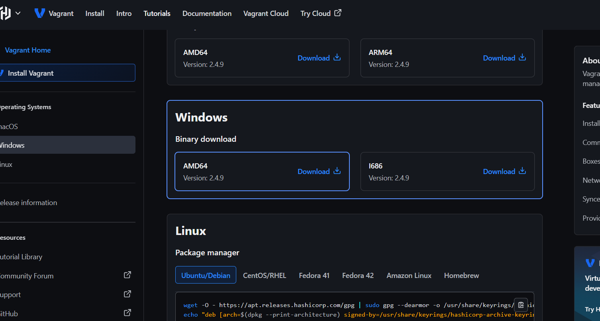
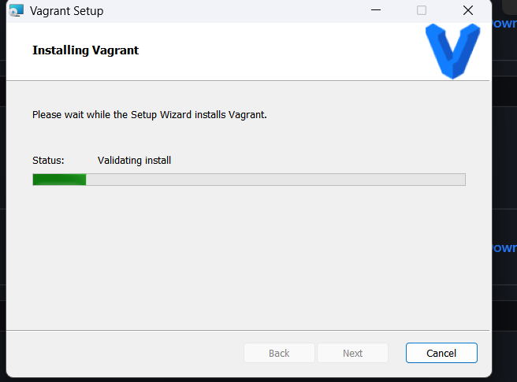

# Experiment: Creating Ubuntu Virtual Machine using Vagrant and Installing Nginx

## Aim
To install VirtualBox and Vagrant on the host machine, create an Ubuntu virtual machine using Vagrant, install and verify the Nginx web server inside the virtual machine, observe system resource utilization in running and stopped states.

---

## System Configuration
- **Host Operating System**: Windows 
- **Virtualization Software**: VirtualBox
- **VM Management Tool**: Vagrant
- **Guest Operating System**: Ubuntu (hashicorp/bionic64)

---

## Step-by-Step Procedure

---

### Step 1: Download and Install VirtualBox 

Download VirtualBox from:  
https://www.virtualbox.org/wiki/Downloads

### Step 2: Download and Install Vagrant 

Download Vagrant from the official website:  
https://developer.hashicorp.com/vagrant/install

Install Vagrant on the host machine.

📸 Screenshot:  



---

### Step 3: Verify Vagrant Installation 
Open Command Prompt and execute:
```bash
vagrant --version


