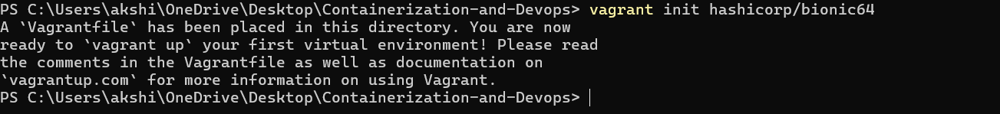
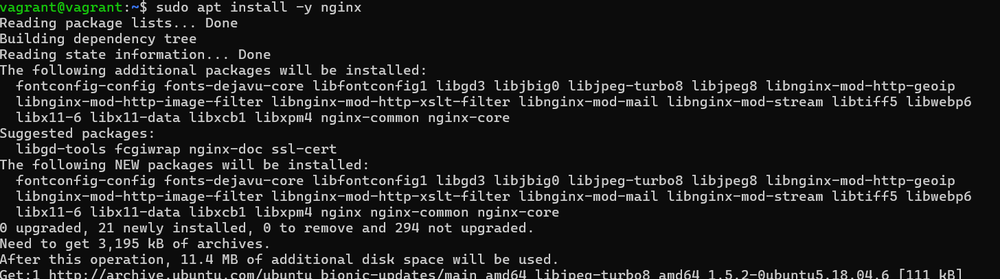
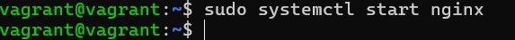
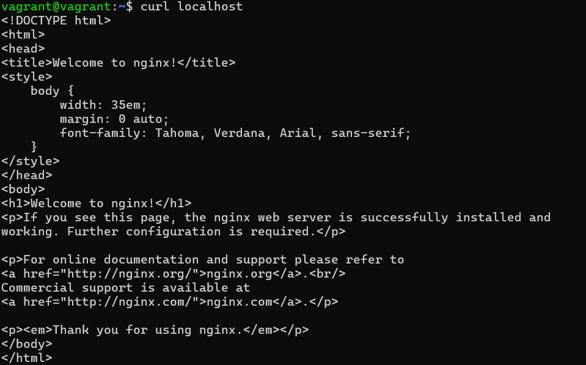
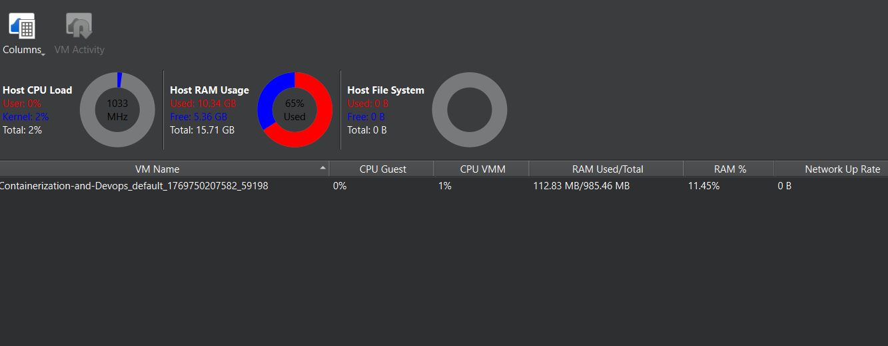
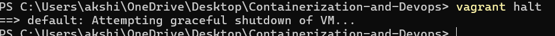

# Experiment: Creating Ubuntu Virtual Machine using Vagrant and Installing Nginx

## Aim
To install VirtualBox and Vagrant on the host machine, create an Ubuntu virtual machine using Vagrant, install and verify the Nginx web server inside the virtual machine, observe system resource utilization in running and stopped states.

---

## System Configuration
- **Host Operating System**: Windows 
- **Virtualization Software**: VirtualBox
- **VM Management Tool**: Vagrant
- **Guest Operating System**: Ubuntu (hashicorp/bionic64)

---

## Step-by-Step Procedure

---

### Step 1: Download and Install VirtualBox 

Download VirtualBox from:  
https://www.virtualbox.org/wiki/Downloads

### Step 2: Download and Install Vagrant 

Download Vagrant from the official website:  
https://developer.hashicorp.com/vagrant/install

Install Vagrant on the host machine.


---

### Step 3: Verify Vagrant Installation 

Open Command Prompt and execute:
```bash
vagrant --version 
```


### Step 4: Initialize Vagrant with Ubuntu box

```bash
vagrant init hashicorp/bionic64
```


### Step 5: Start the Ubuntu Virtual Machine

```bash
vagrant up
```


### Step 6: Access the Virtual Machine using SSH

```bash
vagrant ssh
```


### Step 7: Update Package Repository

```bash
sudo apt update
```


### Step 8: Install Nginx Web Server inside VM

```bash
sudo apt install -y nginx
```


Start the Nginx service

```bash
sudo systemctl start nginx

```


### Step 9: Verify Nginx Installation

```bash
curl localhost
```


---

### Step 10: Observe Utilization Matrix in Running State



---

### Step 11: Stop the Virtual Machine

```bash
vagrant halt
```


---

### Step 12: Observe Utilization Matrix in Stopped State 


---

### Step 13: Remove the Virtual Machine

```bash
vagrant destroy
```


---

### Verifying removal of VM


