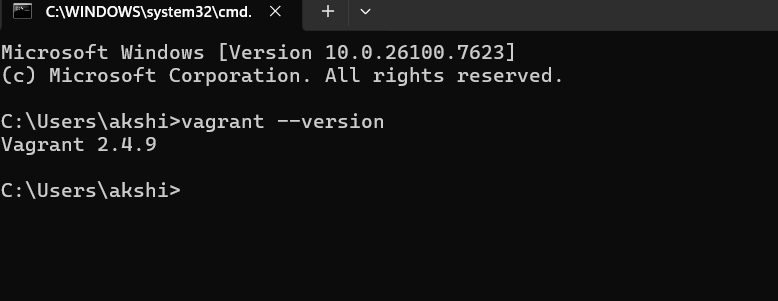
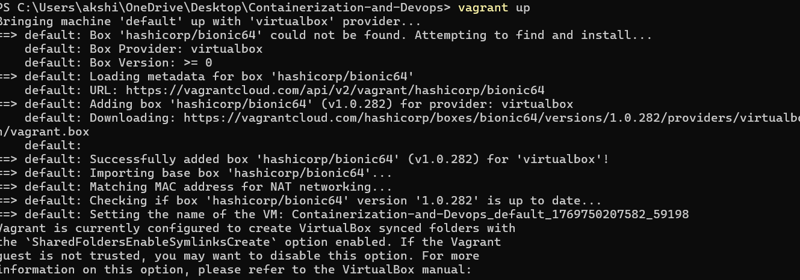
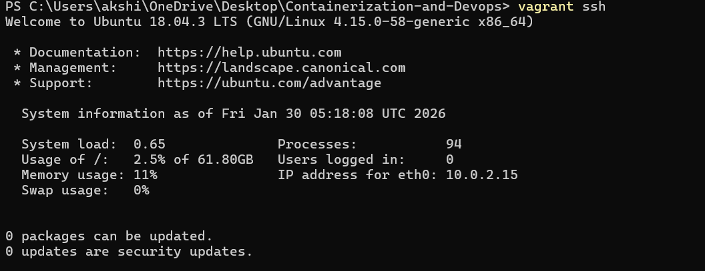
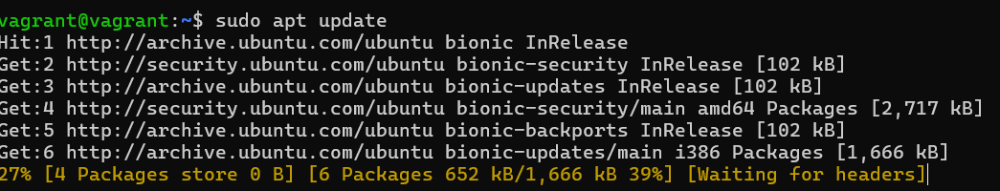
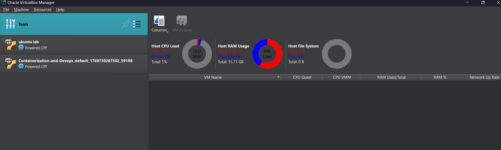
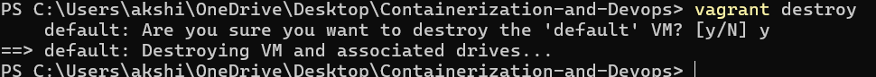
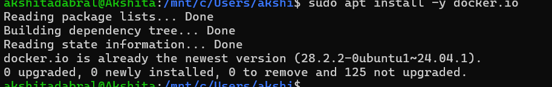
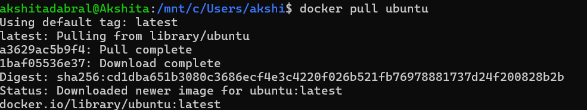
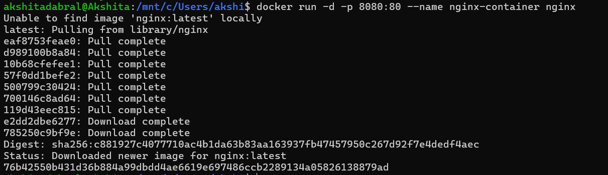

# Experiment 1: 
# Comparison of Virtual Machines (VMs) and Containers using Ubuntu and Nginx

## Objective :
1. To understand the conceptual and practical differences between Virtual Machines and Containers.

2. To install and configure a Virtual Machine using VirtualBox and Vagrant on Windows.

3. To install and configure Containers using Docker inside WSL.

4. To deploy an Ubuntu-based Nginx web server in both environments.

5. To compare resource utilization, performance, and operational characteristics of VMs and Containers.

---

## REQUIREMENTS :

### HARDWARE :
- 64-bit system with virtualization support enabled in BIOS

- Minimum 8 GB RAM (4 GB minimum acceptable)

- Internet connection
---
### SOFTWARE :

- Oracle VirtualBox

- Vagrant

- Windows Subsystem for Linux (WSL 2)

- Ubuntu (WSL distribution)

- Docker Engine (docker.io)

## PROCEDURE :

---
### EXPERIMENT PART A : Virtual Machine (Windows)
### Step 1: Download and Install VirtualBox 

Download VirtualBox from:  
https://www.virtualbox.org/wiki/Downloads

### Step 2: Download and Install Vagrant 

Download Vagrant from the official website:  
https://developer.hashicorp.com/vagrant/install

Install Vagrant on the host machine.


---

### Step 3: Verify Vagrant Installation 

Open Command Prompt and execute:
```bash
vagrant --version 
```



### Step 4: Initialize Vagrant with Ubuntu box

```bash
vagrant init hashicorp/bionic64
```


### Step 5: Start the Ubuntu Virtual Machine

```bash
vagrant up
```


### Step 6: Access the Virtual Machine using SSH

```bash
vagrant ssh
```


### Step 7: Update Package Repository

```bash
sudo apt update
```


### Step 8: Install Nginx Web Server inside VM

```bash
sudo apt install -y nginx
```


Start the Nginx service

```bash
sudo systemctl start nginx

```


### Step 9: Verify Nginx Installation

```bash
curl localhost
```


---

### Step 10: Observe Utilization Matrix in Running State


---

### Step 11: Stop the Virtual Machine

```bash
vagrant halt
```


---

### Step 12: Observe Utilization Matrix in Stopped State 



---

### Step 13: Remove the Virtual Machine

```bash
vagrant destroy
```


---

### Verifying removal of VM


---

### EXPERIMENT PART B : Containers using WSL (Windows)

### Step 1: Install WSL

```bash
wsl --install
```
### Step 2: Install Ubuntu on  WSL

```bash
wsl --install -d Ubuntu
```
### Step 3: Install Docker Engine inside WSL

```bash
sudo apt update
sudo apt install -y docker.io
sudo systemctl start docker
sudo usermod -aG docker $USER
```



### Step 4: Run Ubuntu Container with Nginx

```bash
docker pull ubuntu
docker run -d -p 8080:80 --name nginx-container nginx
```


### Step 5: Verify Nginx in Container 

```bash
curl localhost:8080
```


---

### Step 6: Observe Utilization Matrix 

```bash
docker stats
free -h
```


---
## PARAMETERS TO COMPARE

| Parameter        | Virtual Machine | Container   |
|------------------|-----------------|-------------|
| Boot Time        | High            | Very Low    |
| RAM Usage        | High            | Low         |
| CPU Overhead     | Higher          | Minimal     |
| Disk Usage       | Larger          | Smaller     |
| Isolation        | Strong          | Moderate    |

---

## RESULTS

The experiment demonstrates that containers are significantly more lightweight and resource-efficient compared to virtual machines, while virtual machines provide stronger isolation and full OS-level abstraction.

## CONCLUSION

Virtual Machines are suitable for full OS isolation and legacy workloads, whereas Containers are ideal for microservices, rapid deployment, and efficient resource utilization.