# Experiment 10: SonarQube - Static Code Analysis

## Objective
To perform static code analysis using SonarQube and identify bugs, vulnerabilities, and code smells in a Java application.

---

## Theory

**What is SonarQube?**

SonarQube is an open-source platform used for static code analysis, which scans source code without executing it. It detects:

- Bugs (runtime errors)
- Vulnerabilities (security risks)
- Code smells (poor coding practices)

**Why is it needed?**

Manual code review is:

- Slow
- Inconsistent
- Not scalable

**SonarQube solves this by:**

- Automatically scanning code on every build
- Providing a visual dashboard
- Enforcing Quality Gates
- Tracking technical debt

**Key Concepts**
- Bug → Code that may fail at runtime
- Vulnerability → Security issue
- Code Smell → Poor maintainability
- Quality Gate → Pass/fail condition for code quality
- Technical Debt → Time required to fix issues

---

## Prerequisites
**Install Maven**
```
mvn -version
```

**If not installed:**
```
sudo apt install maven
```
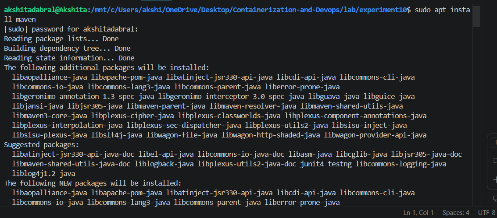
---
## STEPS
### **1. Start SonarQube Server**
- **Create Folder**
```

mkdir sonarqube-lab
cd sonarqube-lab
```

## Create docker-compose.yml
- [docker-compose.yml](./sonarqube-lab/docker-compose.yml)
```
version: '3.8'

services:
  sonar-db:
    image: postgres:13
    container_name: sonar-db
    environment:
      POSTGRES_USER: sonar
      POSTGRES_PASSWORD: sonar
      POSTGRES_DB: sonarqube
      POSTGRES_HOST_AUTH_METHOD: trust
    volumes:
      - sonar-db-data:/var/lib/postgresql/data
    networks:
      - sonarqube-lab

  sonarqube:
    image: sonarqube:lts-community
    container_name: sonarqube
    ports:
      - "9000:9000"
    environment:
      SONAR_JDBC_URL: jdbc:postgresql://sonar-db:5432/sonarqube
      SONAR_JDBC_USERNAME: sonar
      SONAR_JDBC_PASSWORD: sonar
    volumes:
      - sonar-data:/opt/sonarqube/data
      - sonar-extensions:/opt/sonarqube/extensions
    depends_on:
      - sonar-db
    networks:
      - sonarqube-lab

volumes:
  sonar-db-data:
  sonar-data:
  sonar-extensions:

networks:
  sonarqube-lab:
    driver: bridge
```


- **Start server**
```
docker-compose up -d
```
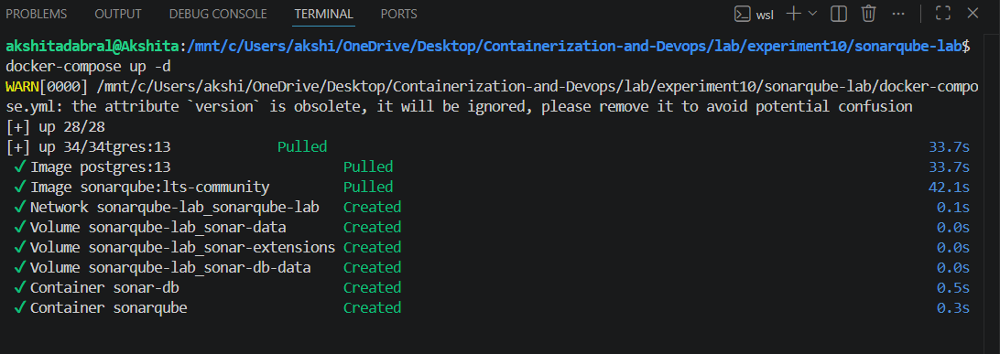

- **Check logs**
```
docker-compose logs -f sonarqube
```
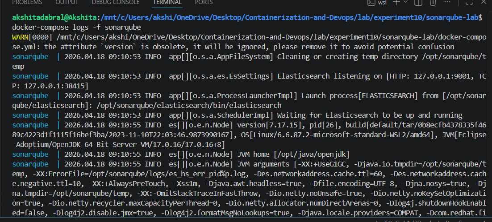

- **Open browser :**
http://localhost:9000

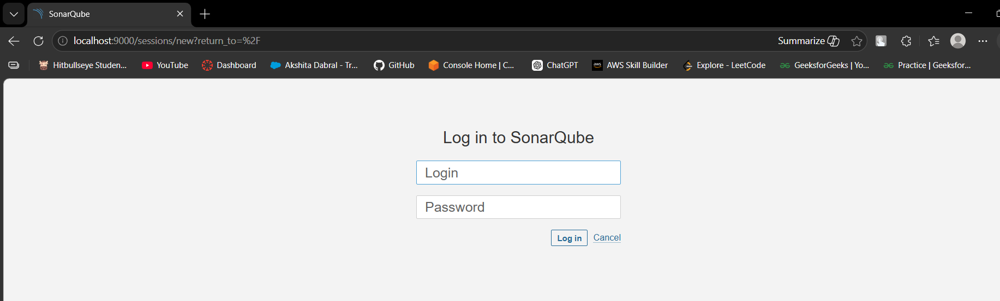


-  Login and change password when asked.

---

## **2. Generate Token**
- Click profile icon (top right)
- Go to My Account: Click Security
- Enter name → scanner-token
Click Generate and **SAVE TOKEN**.

---
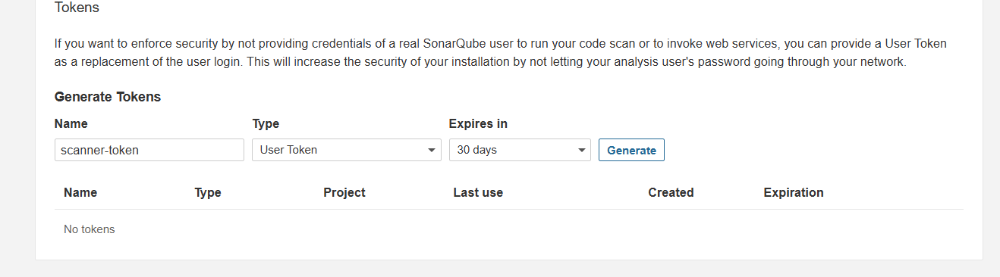

### **3. Create Java Project**

A sample Java project was created with intentional issues:

- Division by zero (bug)
- SQL injection risk (vulnerability)
- Unused variables (code smell)
- Duplicate methods
- Null pointer risk
```
mkdir -p sample-java-app/src/main/java/com/example
cd sample-java-app
```
- **Create Java file** :
 [Calculator.java](./sample-java-app/src/main/java/com/example/Calculator.java)
```
nano src/main/java/com/example/Calculator.java
```
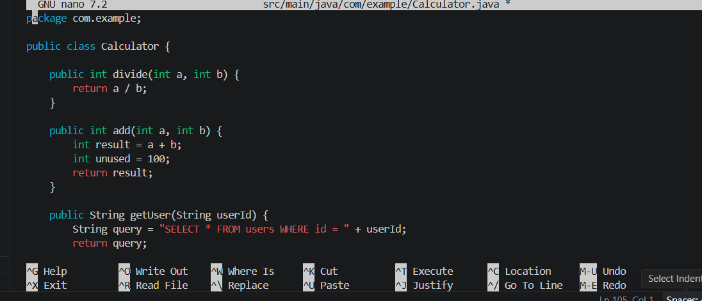

- **Create pom.xml**
nano [pom.xml](./sample-java-app/pom.xml)

```
<?xml version="1.0" encoding="UTF-8"?>
<project xmlns="http://maven.apache.org/POM/4.0.0"
 xmlns:xsi="http://www.w3.org/2001/XMLSchema-instance"
 xsi:schemaLocation="http://maven.apache.org/POM/4.0.0
 http://maven.apache.org/xsd/maven-4.0.0.xsd">
 <modelVersion>4.0.0</modelVersion>

 <!-- Project identity -->

 <groupId>com.example</groupId>
 <artifactId>sample-app</artifactId>
 <version>1.0-SNAPSHOT</version>
 <properties>
 <maven.compiler.source>11</maven.compiler.source>
 <maven.compiler.target>11</maven.compiler.target>
 <!-- SonarQube connection settings -->
 <sonar.projectKey>sample-java-app</sonar.projectKey>
 <sonar.host.url>http://localhost:9000</sonar.host.url>
 <!-- Replace with your actual token (generated in Step 3) -->
 <sonar.login>YOUR_TOKEN_HERE</sonar.login>
 </properties>
 <dependencies>

 <!-- JUnit for unit tests -->

 <dependency>
 <groupId>junit</groupId>
 <artifactId>junit</artifactId>
 <version>4.13.2</version>
 <scope>test</scope>
 </dependency>
 </dependencies>
 <build>
 <plugins>
 <!-- This plugin lets us run: mvn sonar:sonar -->
 <plugin>
 <groupId>org.sonarsource.scanner.maven</groupId>
 <artifactId>sonar-maven-plugin</artifactId>
 <version>3.9.1.2184</version>
 </plugin>
 </plugins>
 </build>
</project>

```
---

### **4. Run Sonar Scanner**

This step:

- Compiled code
- Scanned for issues
- Sent report to SonarQube server

- **Inside project folder:**
```
mvn sonar:sonar -Dsonar.login=YOUR_TOKEN
```
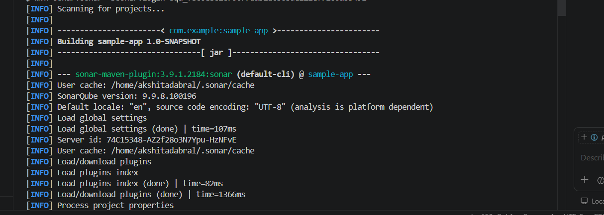

---

### **5. View Results**

- **Open:**

http://localhost:9000

- **Click project: sample-java-app**
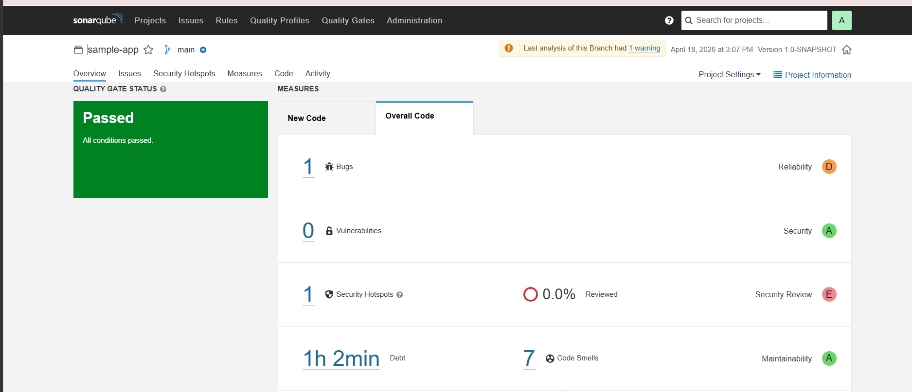
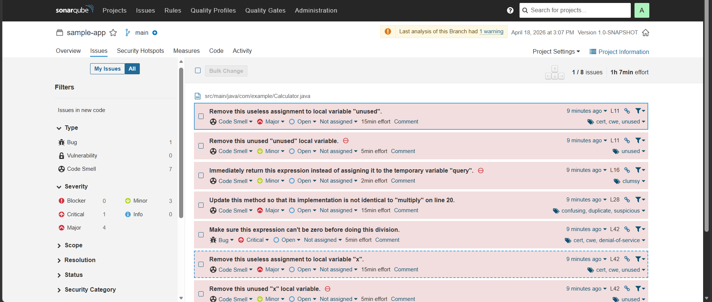

- **Observed:**

- Bugs detected
- Vulnerabilities identified
- Code smells highlighted
- Quality Gate status (Failed/Passed)
- Technical debt estimation
---

### **6. Check API**
```
curl -u YOUR_TOKEN: \
"http://localhost:9000/api/issues/search?projectKeys=sample-java-app"
```

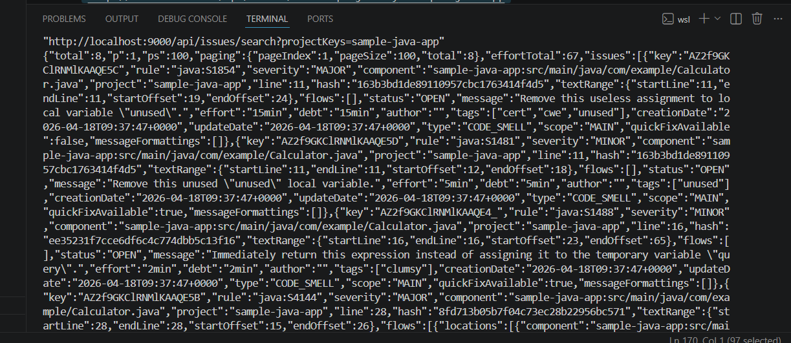

---

### **7. Stop Server**
```
docker-compose down
```
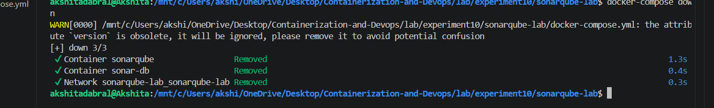

---

## Observations
- SonarQube successfully detected multiple issues in the code
- Dashboard provided detailed visualization of problems
- Quality Gate failed due to detected issues
- Token-based authentication ensured secure communication
= Static analysis helped identify problems before execution

---
 
## Result

Successfully performed static code analysis using SonarQube, and identified bugs, vulnerabilities, and code smells in the Java application.