# Experiment 11: Orchestration using Docker Compose & Docker Swarm

## Objective

To understand container orchestration using:

- **Docker Compose** → Multi-container application management
- **Docker Swarm** → Orchestration with scaling, self-healing, and load balancing

---

### **Introduction to Orchestration**

Orchestration means automatic management of containers.

It handles:

- Scaling containers up/down automatically
- Restarting failed containers (self-healing)
- Distributing traffic (load balancing)
- Managing containers across machines

---

### **Docker Progression**

Docker run → Docker Compose → Docker Swarm → Kubernetes

| Stage              | Description                     |
|--------------------|---------------------------------|
| docker run         | Single container execution      |
| docker compose     | Multi-container applications    |
| docker swarm       | Basic container orchestration   |
| kubernetes         | Advanced orchestration system   |

---

##  Prerequisites
- Docker Desktop installed
- Docker Engine running
- Clean Existing Containers
```
docker compose down -v
docker ps
```
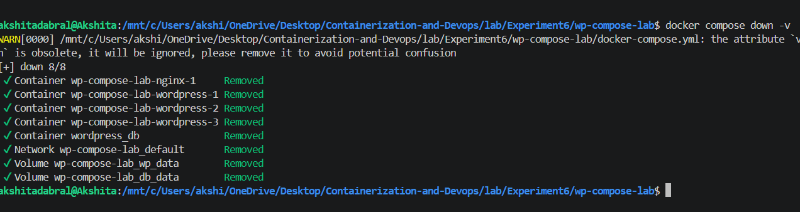


---
## IMPLEMENTATION

**1. Initialize Docker Swarm**

```
docker swarm init
```
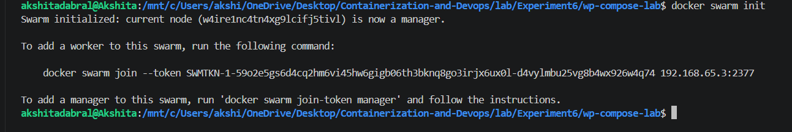

- Swarm initialized
- This node is now a manager

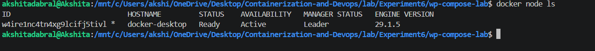

**2.  Deploy Stack (Swarm Mode)**

Using compose file from Experiment 6,

```
docker stack deploy -c docker-compose.yml wpstack
```
- Swarm creates services instead of containers
- Services manage container lifecycle

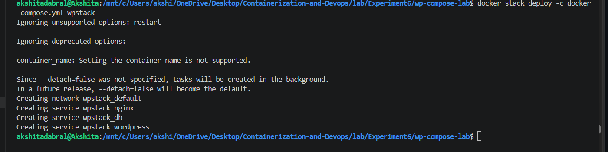

**3. Check Services**
```
docker service ls
```
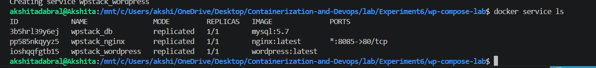

**Check Running Containers**
```
docker ps
```
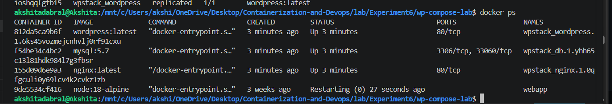

**4. Access Application**

```
http://localhost:8085
```

**5. Scaling Services**

Scale WordPress service:
```
docker service scale wpstack_wordpress=3
```
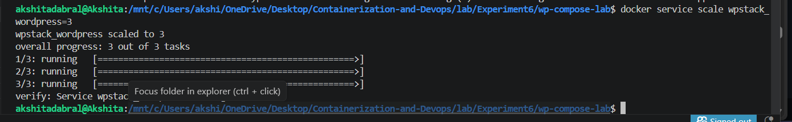

**Verify**
```
docker service ls
```
**Result:**
- 3 WordPress containers run
- Traffic is load balanced automatically
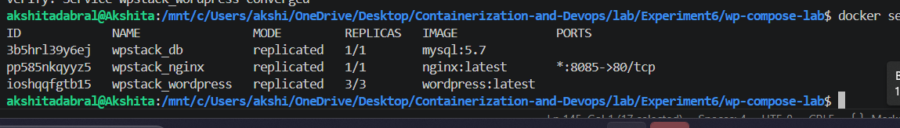

---

**6. Test Self-Healing (Automatic Recovery)**

Docker Swarm automatically detects failed containers and recreates them to maintain the desired state.

**(i) Check running containers**
```
docker ps | grep wordpress
```
- 3 WordPress containers running simultaneously.

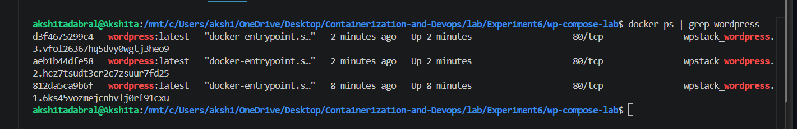

**(ii) Simulate Failure (Kill a container)**
```
docker kill <container-id>
```
Example:
```
docker kill abcd1234
```
**(iii) Swarm Self-Healing Action**

Check service status:
```
docker service ps wpstack_wordpress
```
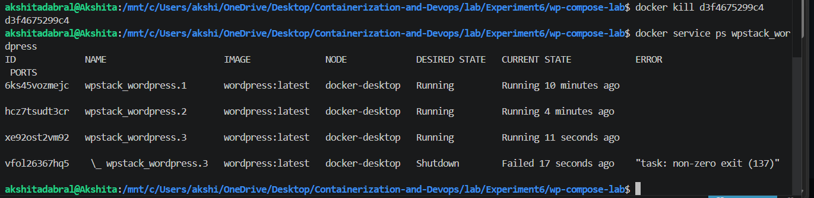
**Observation:**
- The killed container shows Shutdown/Failed
- Swarm automatically creates a new replacement container
- Total replicas remain 3/3

**4. Verify Recovery**
```
docker ps | grep wordpress
```
**Result:**
- Still 3 WordPress containers running
- Swarm has successfully restored the system
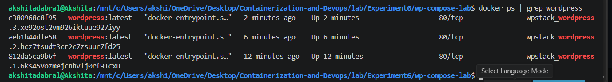

**- Remove Stack**
```
docker stack rm wpstack
```
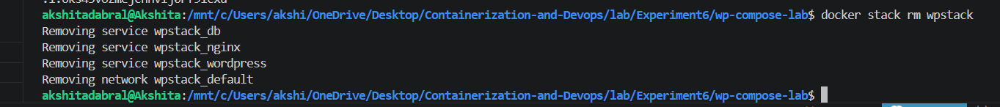

**- Verify removal:**
```
docker service ls
```
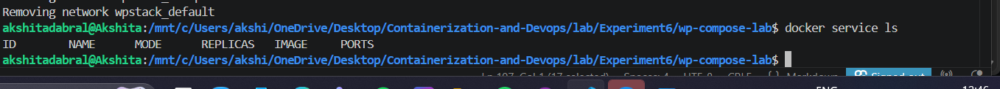

---

## Analysis (Docker Compose vs Docker Swarm)

| Feature            | Docker Compose                          | Docker Swarm                          |
|--------------------|----------------------------------------|---------------------------------------|
| Scope              | Single host only                       | Multi-node cluster                   |
| Scaling            | `--scale` flag (basic, no load balancing) | `docker service scale` (built-in)    |
| Load Balancing     | No (port conflicts)                    | Yes (internal load balancer)         |
| Self-Healing       | No (must restart manually)             | Yes (automatic)                      |
| Rolling Updates    | No                                     | Yes (zero downtime)                  |
| Service Discovery  | Via container names                    | Via DNS + VIP                       |
| Use Case           | Development, testing                   | Simple production clusters          |
| Complexity         | Low                                    | Medium                               |

### When to Use What?

- Development → Docker Compose  
- Testing → Docker Compose  
- Small Production → Docker Swarm  
- Large Production → Kubernetes

---

## CONCLUSION
- Learned container orchestration using Docker Compose and Docker Swarm.
- Understood difference between Compose (multi-container) and Swarm (orchestration).
- Deployed a WordPress application stack using Swarm.
- Performed scaling by increasing replicas of services.
- Observed load balancing across multiple containers.
- Tested self-healing, where Swarm automatically replaced a failed container.
- Confirmed high availability and automatic recovery of services.

