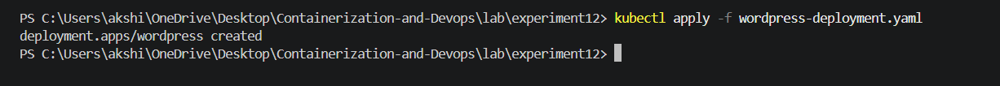
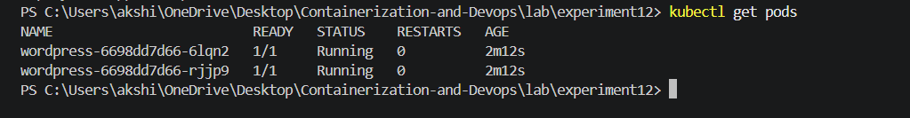
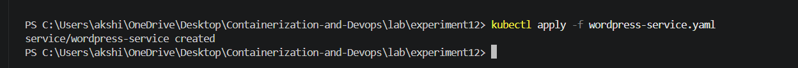
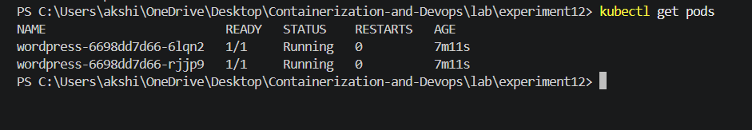
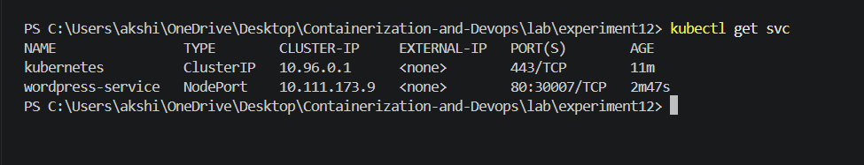
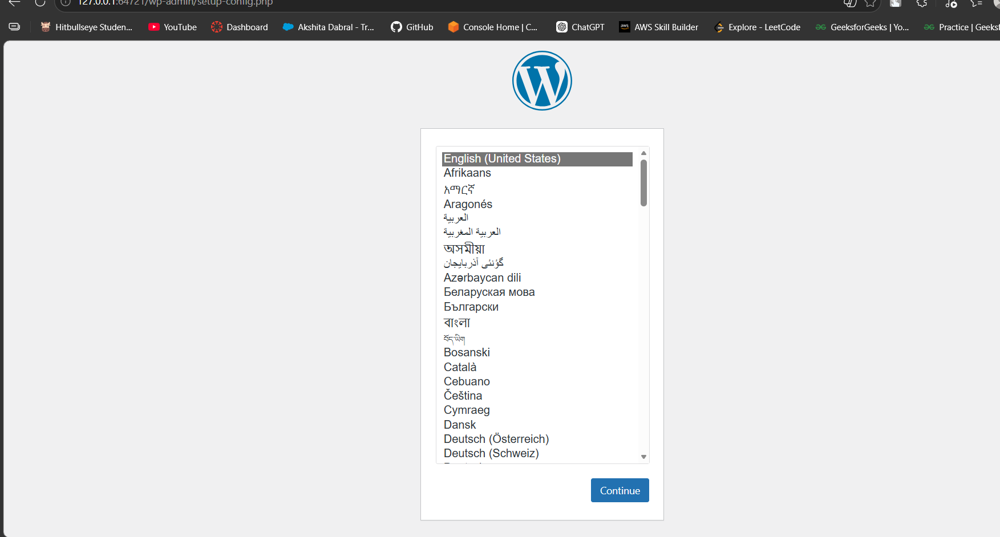
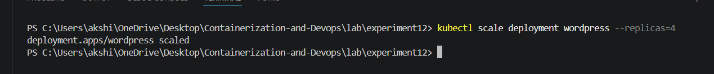
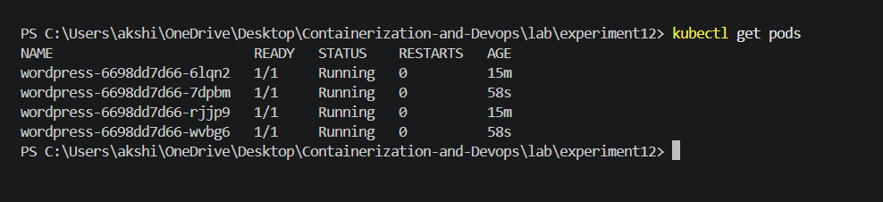
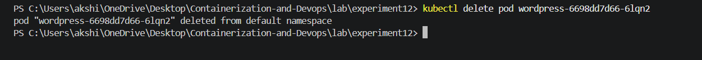
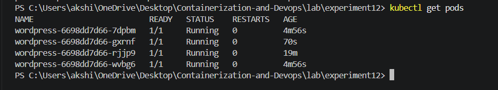

# Experiment 12: Study and Analyse Container Orchestration using Kubernetes

## Objective

To understand:

- Why Kubernetes is used in modern DevOps
- Basic Kubernetes architecture and components
- Deployment of applications using Kubernetes
- Scaling applications dynamically
- Self-healing mechanism of Kubernetes

---

## Introduction

Kubernetes is an open-source container orchestration platform used to manage containerized applications automatically.

Instead of manually running Docker containers, Kubernetes handles:

- Deployment of applications
- Scaling applications up/down
- Restarting failed containers automatically
- Load balancing traffic
- Managing multi-node clusters

It is widely used in companies like Google, Amazon, Microsoft, and Netflix.

---

## Why Kubernetes Over Docker Swarm?

| Feature        | Docker Swarm | Kubernetes   |
|----------------|-------------|--------------|
| Setup          | Easy        | Moderate     |
| Industry Usage | Limited     | Very High    |
| Auto Healing   | Basic       | Advanced     |
| Auto Scaling   | Limited     | Powerful     |
| Cloud Support  | Medium      | Excellent    |
| Ecosystem      | Small       | Huge         |

- **Conclusion:** Kubernetes is the industry standard for container orchestration.

---

## Core Concepts 
| Kubernetes Object | Meaning |
|------------------|--------|
| Pod              | Smallest unit, runs container(s) |
| Deployment       | Manages multiple pod copies |
| Service          | Exposes application to network |
| ReplicaSet       | Ensures required number of pods run |

## Tools Used
- Minikube 
- kubectl (command-line tool)
- Docker (container runtime)
- WordPress image from Docker Hub

---

## Implementation

## Task 1: Create Deployment

A Deployment is used to run multiple copies of an application.

- We will deploy WordPress.

1. **Create YAML File**:  [wordpress-deployment.yaml](./wordpress-deployment.yaml)

```
apiVersion: apps/v1
kind: Deployment
metadata:
  name: wordpress

spec:
  replicas: 2

  selector:
    matchLabels:
      app: wordpress

  template:
    metadata:
      labels:
        app: wordpress

    spec:
      containers:
      - name: wordpress
        image: wordpress:latest

        ports:
        - containerPort: 80

```
**2. Run**
```
kubectl apply -f wordpress-deployment.yaml
```



**3. Results**

- Kubernetes created 2 pods
- Each pod runs WordPress container


```
kubectl get pods
```


---

## Task 2 – Expose Deployment as Service

A Service gives a stable IP and external access.

**1. Create Service File: [wordpress-service.yaml](./wordpress-service.yaml)**
```
apiVersion: v1
kind: Service

metadata:
  name: wordpress-service

spec:
  type: NodePort

  selector:
    app: wordpress

  ports:
  - port: 80
    targetPort: 80
    nodePort: 30007
```

**2. Apply Service**

```
kubectl apply -f wordpress-service.yaml
```


**3. Verify Deployment**
**(i) Check Pods**
```
kubectl get pods
```

- Output shows 2 running WordPress pods.

**(ii) Check Services**

```
kubectl get svc
```

- Service exposes app on NodePort 30007

- **Access Application:**
```
minikube service wordpress-service
```
OR:
```
http://<minikube-ip>:30007
```


---

## Task 4: Scaling the Application

**1. Run:**
```
kubectl scale deployment wordpress --replicas=4
```


- **Verify:**
```
kubectl get pods
```

 
## Result:
- Pods increased from 2 to 4
- Application can handle more traffic

---

## Task 5: Self-Healing Demonstration

Kubernetes automatically replaces failed pods.

**1. See Pod Names**

```
kubectl get pods
```
Example:

wordpress-abc123
wordpress-def456
wordpress-ghi789
wordpress-jkl000

**2. Delete One Pod**

```
kubectl delete pod wordpress-6698dd7d66-6lqn2 
```


**3. Check Again**
```
kubectl get pods
```
**4. Observation:**
- Deleted pod is automatically recreated
- Desired state (4 pods) is maintained



---
## Observations 
- Pods are created successfully 
- Service exposes application externally 
- Scaling works dynamically
- Self-healing ensures reliability

--- 
## Conclusion

Kubernetes is a powerful container orchestration system that automates deployment, scaling, and management of containerized applications.

- Deployment and Service creation 
- Scaling applications dynamically 
- Self-healing behavior of Kubernetes