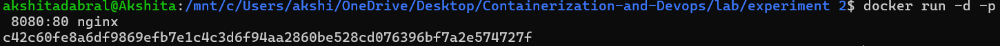
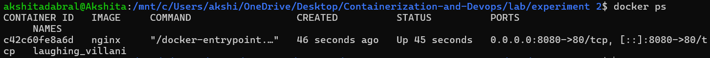
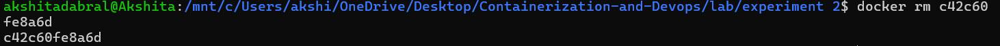

# Experiment 2: 
# Docker Installation,Configuration, and Running Images

## Objective :
- Pull Docker images

- Run containers

- Manage container lifecycle

## PROCEDURE :

### Step 1: Pull Image 

```bash
docker pull nginx
```


---
### Step 2: Run Container with Port Mapping

```bash
docker run -d -p 8080:80 nginx
```


---
### Step 3: Verify Running Containers

```bash
docker ps
```


---
### Step 4: Stop and Remove Container

```bash
docker stop <container_id>
```


```bash
docker rm <container_id>
```


---
### Step 5: Remove Image

```bash
docker rmi nginx
```


---
## RESULTS

Docker images were successfully pulled, containers executed, and lifecycle commands performed.