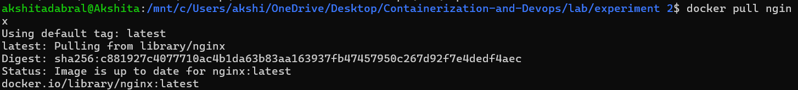
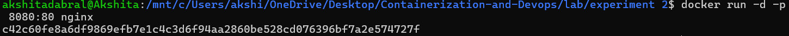
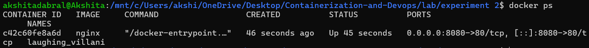
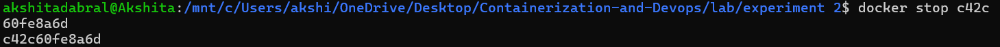
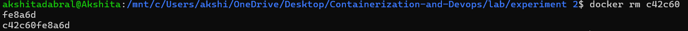
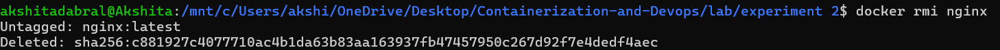

# Experiment 2: 
# Docker Installation,Configuration, and Running Images

## Objective :
The objective of this experiment is to:

- Pull Docker images from Docker Hub
- Run containers using Docker images
- Manage the container lifecycle (start, stop, remove containers and images)

## PROCEDURE :

### Step 1: Pull Image 
The required Docker image was pulled from the Docker Hub repository using the following command:

```bash
docker pull nginx
```
This command downloads the latest version of the Nginx image to the local system.


---
### Step 2: Run Container with Port Mapping
A container was created and started in detached mode with port mapping:
```bash
docker run -d -p 8080:80 nginx
```
- **-d** runs the container in background
- -**p 8080:80** maps port 8080 of the host to port 80 of the container


---
### Step 3: Verify Running Containers
To check whether the container is running successfully, the following command was used:
```bash
docker ps
```
This displays a list of all active containers.


---
### Step 4: Stop and Remove Container
The running container was stopped and removed using:
```bash
docker stop <container_id>
```
- **docker stop** halts the container
- **docker rm** deletes the container from the system


```bash
docker rm <container_id>
```


---
### Step 5: Remove Image
Finally, the Docker image was removed using:
```bash
docker rmi nginx
```

This deletes the image from the local repository.

---
## RESULTS

The experiment was successfully executed. Docker images were pulled, containers were created and run, and container lifecycle operations such as stopping, removing containers, and deleting images were performed successfully.

---

## CONCLUSION

This experiment demonstrated the basic usage of Docker for containerization, including image management and container lifecycle operations. 

It highlights how Docker enables lightweight and efficient application deployment compared to traditional virtual machines. Containers are particularly useful for rapid deployment and microservices architecture, while virtual machines provide stronger isolation.
