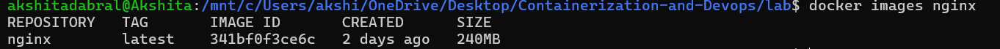
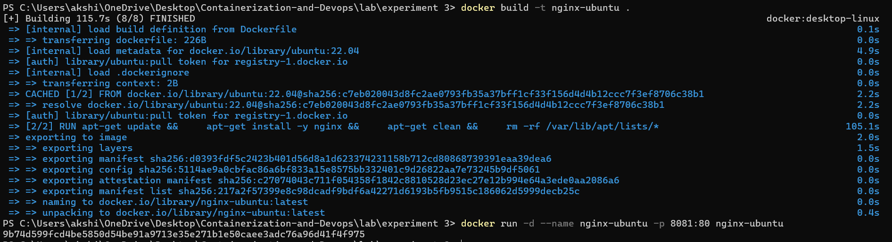

# Experiment 3.1: 
# Deploying NGINX Using Different Base Images and Comparing Image Layers
---
## Lab Objectives


1. Deploy NGINX using:

- Official nginx image
- Ubuntu-based image
- Alpine-based image

2. Understand Docker image layers and size differences
3. Compare performance, security, and use-cases of each approach
4. Explain real-world use of NGINX in containerized systems

## Prerequisites

1. Docker installed and running
2. Basic knowledge of:

- docker run

- Dockerfile

- Port mapping

3. Linux command basics

---

# Part 1: Deploy NGINX Using Official Image (Recommended Approach)

**Step 1**: Pull the Image
```bash
docker pull nginx:latest
```
**Step 2**: Run the Container

```bash
docker run -d --name nginx-official -p 8080:80 nginx
```

**Step 3**: Verify
```bash
curl http://localhost:8080
```
You should see the NGINX welcome page.


---
## Key Observations

```bash
docker images nginx
```

- Image is pre-optimized
-  Minimal configuration required
-  Uses Debian-based OS internally


---


# Part 2: Custom NGINX Using Ubuntu Base Image

**Step 1**: Create Dockerfile

```bash
FROM ubuntu: 22.04

RUN apt-get update && \
apt-get install -y nginx && \
apt-get clean && \
rm -rf /var/lib/apt/lists/*

EXPOSE 80

CMD ["nginx", "-g", "daemon off;"]
```

**Step 2**: Build Image
```bash
docker build -t nginx-ubuntu .
```
**Step 3**: Run Container

docker run -d -- name nginx-ubuntu -p 8081:80 nginx-ubuntu


## Observations

```bash
docker images nginx-ubuntu
```
-  Much larger image size
- More layers
- Full OS utilities available


---

# Part 3: Custom NGINX Using Alpine Base Image

**Step 1**: Create Dockerfile
```bash
FROM alpine:latest

RUN apk add -- no-cache nginx

EXPOSE 80

CMD ["nginx", "-g", "daemon off;"]
```

**Step 2**: Build Image
```bash
docker build -t nginx-alpine .
```

**Step 3**: Run Container
```bash
docker run -d -- name nginx-alpine -p 8082:80 nginx-alpine
```

## Observations
```bash
docker images nginx-alpine
```
- Extremely small image
- Fewer packages
- Faster pull and startup time


---

# Part 4: Image Size and Layer Comparison

- Compare Sizes

```bash
docker images | grep nginx
```


## Inspect Layers
```bash
docker history nginx
docker history nginx-ubuntu
docker history nginx-alpine
```
## Observations:

- Ubuntu has many filesystem layers
- Alpine has minimal layers
- Official NGINX image is optimized but heavier than Alpine


--- 

# Part 5: Functional Tasks Using NGINX

##  Task 1: Serve Custom HTML Page

```bash
mkdir html
echo "<h1>Hello from Docker NGINX</h1>" > html/index.html
```
- Run:
```bash
docker run -d \
-p 8083:80 \
-v $(pwd)/html:/usr/share/nginx/html \
nginx
```


## Task 2: Reverse Proxy (Conceptual)

### NGINX can:

- Forward traffic to backend services
- Load balance multiple containers
- Terminate SSL

### Example use cases:

- Frontend for microservices
- API gateway
- Static file server

---
# Experiment 3.2: Flask Application – Docker 
[README.md](./experiment3.2/README.md)
