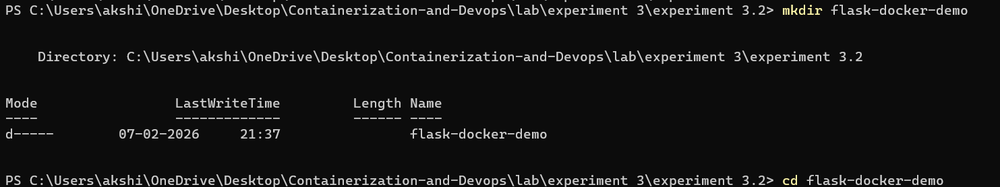
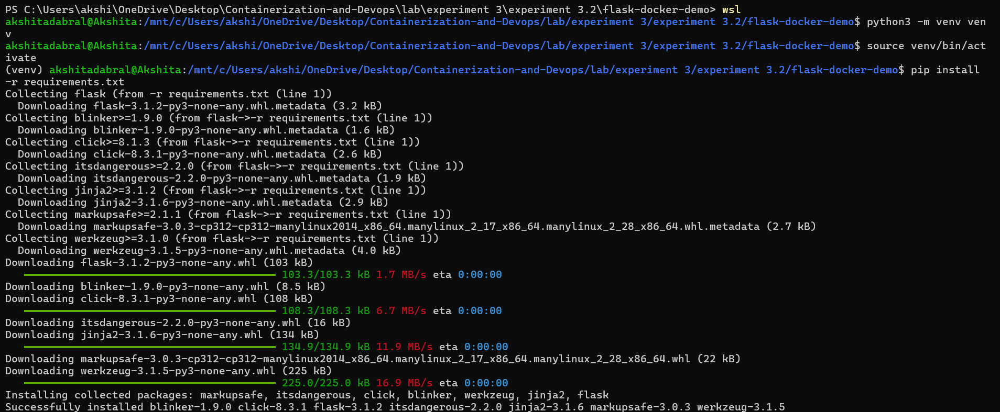
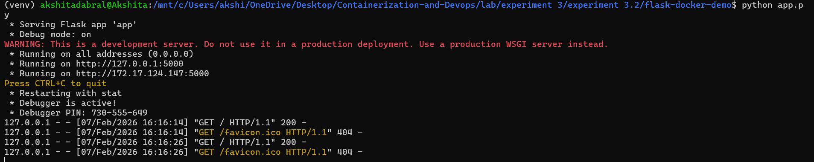
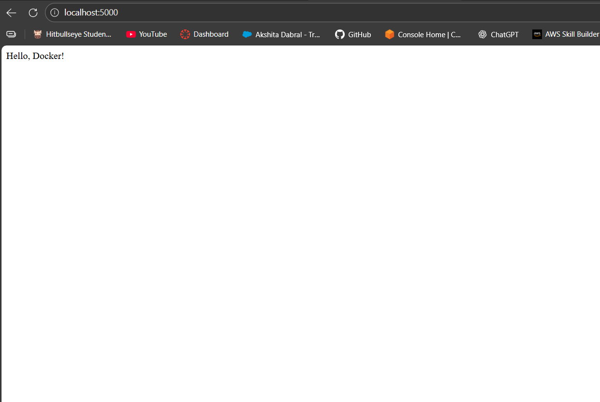
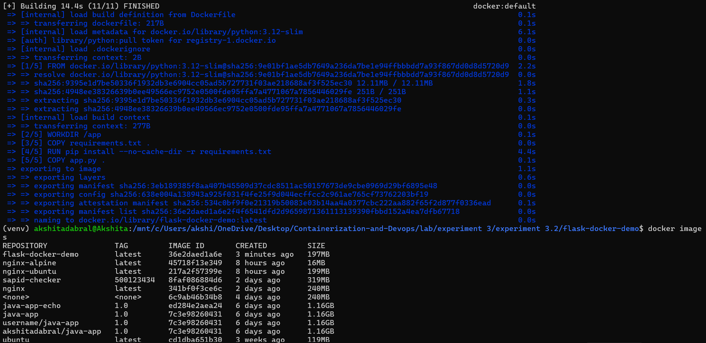
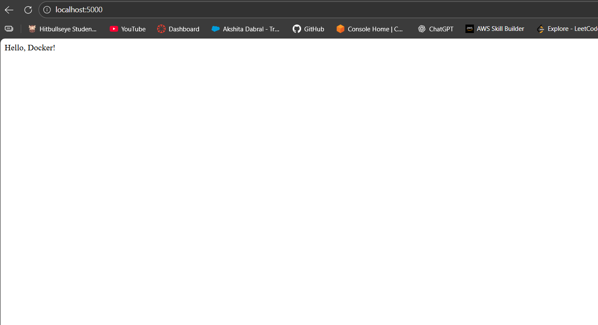

# Experiment 3.2: 
## Flask Application – Docker Experiment
---
## Overview

This experiment demonstrates the development of a lightweight Python Flask web application, testing it locally, and then containerizing it using Docker.
The application displays a simple message when accessed through a web browser.

## Lab Objectives

- To select a simple web application suitable for Docker containerization

- To create and organize application files properly

- To test the application locally before deploying it inside a Docker container

- To build a custom Docker image and run the application inside a container

## Technologies Used

- Python 3

- Flask

- Docker

- Web Browser

---

## STEPS
**Step 1** : Create [Project Directory](./flask-docker-demo/) and move into it.

```bash
mkdir flask-docker-demo
cd flask-docker-demo
```


---

**Step 2** : Create a Python file named [app.py](./flask-docker-demo/app.py)
```bash
from flask import Flask

app = Flask(__name__)

@app.route('/')
def hello():
    return 'Hello, Docker!'

if __name__ == "__main__":
    app.run(host="0.0.0.0", port=5000, debug=True)
```
Save and exit.


---

**Step 3** : Create [Requirements File](./flask-docker-demo/requirements.txt)

Add:
```bash
flask
```

Save and exit.

---

**Step 4**: Create Virtual Environment
```bash
python3 -m venv venv
```
---

**Step 5** : Activate Virtual Environment
```bash
source venv/bin/activate
```
After activation, the terminal prompt will change to:
(venv)

---

**Step 6** : Install Required Dependencies
```bash
pip install -r requirements.txt
```


---

**Step 7** : Run the Flask Application
```bash
python app.py
```


---

**Step 8** : Verify the Output

- Open a web browser

- Visit: http://localhost:5000

- Output: Hello, Docker!




---

## Docker Containerization

**Step 9** : Create [Dockerfile](./flask-docker-demo/Dockerfile)

Create a file named Dockerfile inside the project directory.

```bash
FROM python:3.12-slim

WORKDIR /app

COPY requirements.txt .

RUN pip install --no-cache-dir -r requirements.txt

COPY app.py .

EXPOSE 5000

CMD ["python", "app.py"]
```
---
**Step 10** : Build Docker Image

Use Docker to build a custom image from the Dockerfile.

```bash
docker build -t flask-docker-demo .
```
Verify the image creation:

```bash
docker images
```


---

**Step 11** : Run the Application Inside Docker Container

Launch the Flask application inside a Docker container.
```bash
docker run -p 5000:5000 flask-docker-demo
```


---

**Step 12** : Test the Containerized Application

- Open a web browser

- Visit: http://localhost:5000

- Output displayed: Hello, Docker!



This confirms that the application is running successfully inside the Docker container.

- To stop the container, press : CTRL + C

## Result

The Flask web application was successfully created, tested locally, containerized using Docker, and deployed inside a Docker container. The application worked correctly in both local and containerized environments.

---

## Conclusion

This experiment demonstrates the importance of testing an application locally before Dockerization. Containerization using Docker ensures consistency, portability, and ease of deployment across different environments.