# Experiment 4: Docker Essentials

## PROCEDURE :
## Part 1: Containerizing Applications with Dockerfile

---

### Step 1: Create a Simple Flask Application
- Create [project folder](./my-flask-app/)
 ``` bash
 mkdir my-flask-app
cd my-flask-app
```
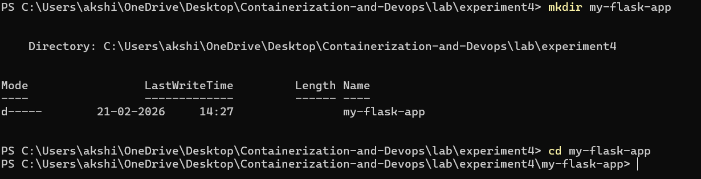

- Create [app.py](./my-flask-app/app.py)
```bash
from flask import Flask

app = Flask(__name__)

@app.route('/')
def hello():
    return "Hello from Docker!"

@app.route('/health')
def health():
    return "OK"

if __name__ == "__main__":
    app.run(host="0.0.0.0", port=5000)

```
- Create [requirements.txt](./my-flask-app/requirement.txt)
```bash
Flask==2.3.3
```
---

### Step 2: Create [Dockerfile](./my-flask-app/Dockerfile)

```bash
FROM python:3.9-slim
WORKDIR /app
COPY requirements.txt .
RUN pip install --no-cache-dir -r requirements.txt
COPY app.py .
EXPOSE 5000
CMD ["python", "app.py"]
```
---
## Part 2: Using .docignore

### Step 1 : Create .dockerignore

```bash
# Python files
__pycache__/
*.pyc
*.pyo
*.pyd

# Environment files
.env
.venv
env/
venv/

# IDE files
.vscode/
.idea/

# Git files
.git/
.gitignore

# OS files
.DS_Store
Thumbs.db

# Logs
*.log
logs/

# Test files
tests/
test_*.py
```
---
### Step 2 : Why .dockerignore is Important

- Prevents unnecessary files from being copied
- Reduces image size
- Improves build speed
- Increases security

---

## Part 3 : Building Docker Image

### Step 1: Basic Build Command
```bash
docker build -t my-flask-app .
docker images
```
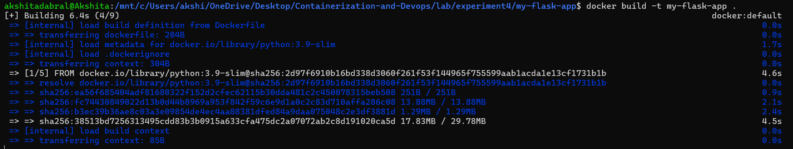

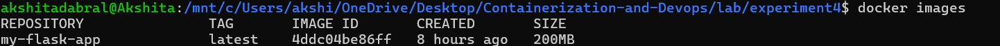

### Step 2: Tagging Images

- Tag with version number
```bash
docker build -t my-flask-app:1.0 .
```
- Tag with multiple tags
```bash
docker build -t my-flask-app:latest -t my-flask-app:1.0 .
```
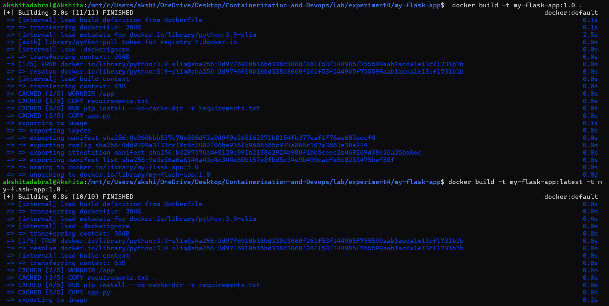

- Tag with custom registry
```bash
docker build -t username/my-flask-app:1.0 .
```
- Tag existing image
```bash
docker tag my-flask-app:latest my-flask-app:v1.0
```
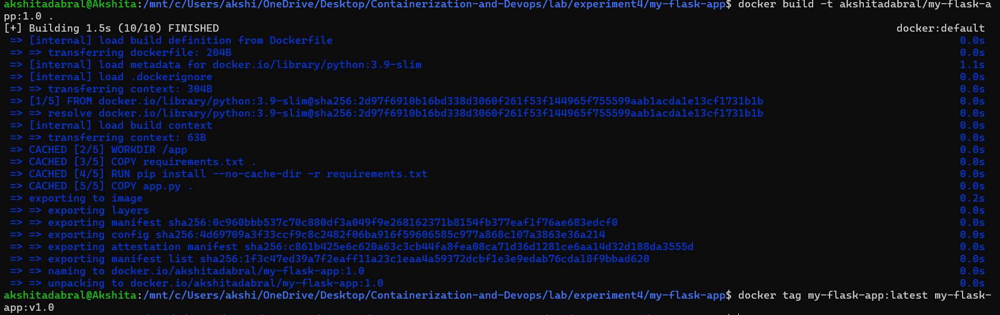

### Step 3: View Image Details

- List all images
```bash
docker images
```
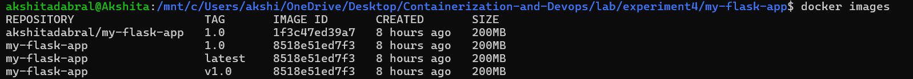


- Show image history
```bash
docker history my-flask-app
```
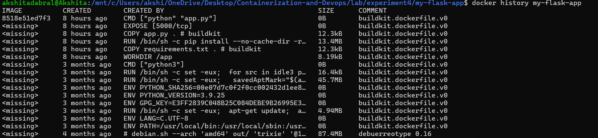

- Inspect image details
```bash
docker inspect my-flask-app
```
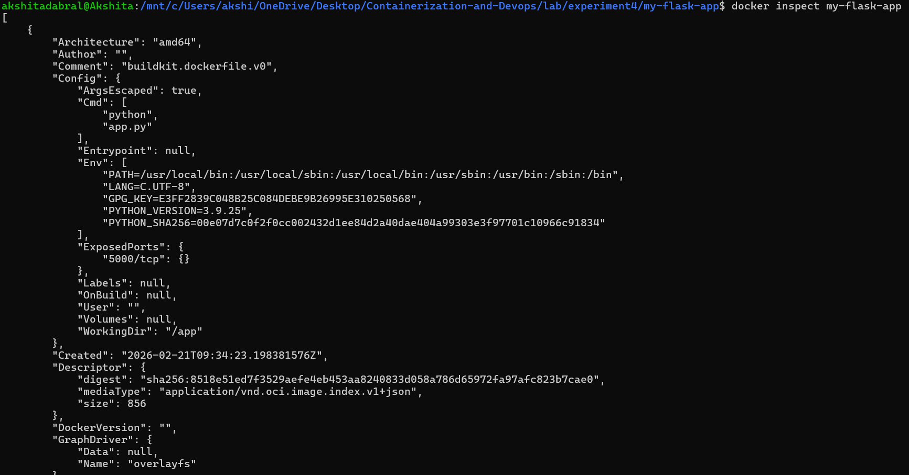

---

## Part 4 : Running Containers

### Step 1: Run Container

- Run container with port mapping
```bash
docker run -d -p 5000:5000 --name flask-container my-flask-app
```
- Test the application
```bash
curl http://localhost:5000
```
- View running containers
```bash
docker ps
```

- View container logs
```bash
docker logs flask-container
```
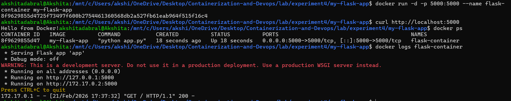

### Step 2: Manage Containers

-  Stop container
```bash
docker stop flask-container
```
- Start stopped container
```bash
docker start flask-container
```
- Remove container
```bash
docker rm flask-container
```
- Remove container forcefully
```bash
docker rm -f flask-container
```
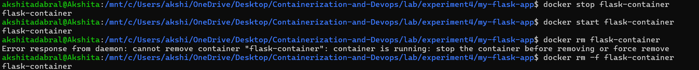

---

## Part 5 :Multi-stage Builds

### Step 1: Why Multi-stage Builds?

- Smaller final image size
- Better security (remove build tools)
- Separate build and runtime environments

### Step 2: Simple Multi-stage Dockerfile

[Dockerfile.multistage](./my-flask-app/Dockerfile.multistage)

```bash
# STAGE 1: Builder stage
FROM python:3.9-slim AS builder

WORKDIR /app

# Copy requirements
COPY requirements.txt .

# Install dependencies in virtual environment
RUN python -m venv /opt/venv
ENV PATH="/opt/venv/bin:$PATH"
RUN pip install --no-cache-dir -r requirements.txt

# STAGE 2: Runtime stage
FROM python:3.9-slim

WORKDIR /app

# Copy virtual environment from builder
COPY --from=builder /opt/venv /opt/venv
ENV PATH="/opt/venv/bin:$PATH"

# Copy application code
COPY app.py .

# Create non-root user
RUN useradd -m -u 1000 appuser
USER appuser

# Expose port
EXPOSE 5000

# Run application
CMD ["python", "app.py"]
```

### Step 3: Build and Compare

- Build regular image
```bash
docker build -t flask-regular .
```
- Build multi-stage image
```bash
docker build -f Dockerfile.multistage -t flask-multistage .
```
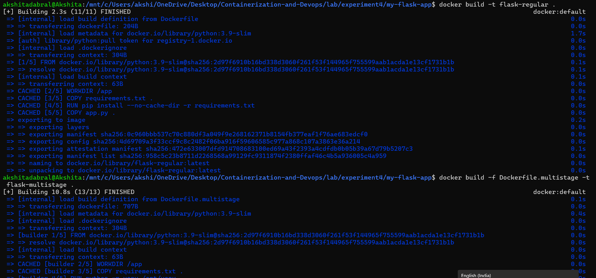

- Compare sizes
```bash
docker images | grep flask-
```
---

## Part 6: Publishing to Docker Hub

### Step 1: Prepare for Publishing

- Login to Docker Hub
```bash
docker login
```

- Tag image for Docker Hub
```bash
docker tag my-flask-app:latest akshitadabral/my-flask-app:1.0

docker tag my-flask-app:latest akshitadabral/my-flask-app:latest
```
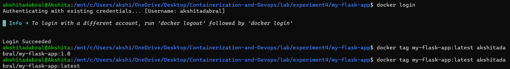

- Push to Docker Hub
```bash
docker push akshitadabral/my-flask-app:1.0
docker push akshitadabral/my-flask-app:latest
```


### Step 2: Pull and Run from Docker Hub

- Pull from Docker Hub (on another machine)
```bash
docker pull akshitadabral/my-flask-app:latest
```
- Run the pulled image
```bash
docker run -d -p 5000:5000 akshitadabral/my-flask-app:latest
```
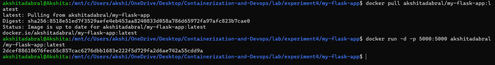

---

## Part 7: Node.js Example (Quick Version)

### Step 1: Node.js Application
```bash
mkdir my-node-app
cd my-node-app
```
- [app. js](./my-node-app/app.js)
```bash
const express = require('express');
const app = express();
const port = 3000;

app.get('/', (req, res) => {
    res.send('Hello from Node.js Docker!');
});

app.get('/health', (req, res) => {
    res.json({ status: 'healthy' });
});

app.listen(port, () => {
    console.log(`Server running on port ${port}`);
});
```
- [package.json](./my-node-app/package.json)
```bash
{
  "name": "node-docker-app",
  "version": "1.0.0",
  "main": "app.js",
  "dependencies": {
    "express": "^4.18.2"
  }
}
```

### Step 2: Node.js [Dockerfile](./my-node-app/Dockerfile)
```bash
FROM node:18-alpine

WORKDIR /app

COPY package*.json ./
RUN npm install --only=production

COPY app.js .

EXPOSE 3000

CMD ["node", "app.js"]
```
### Step 3: Build and Run

- Build image
```bash
docker build -t my-node-app .
```
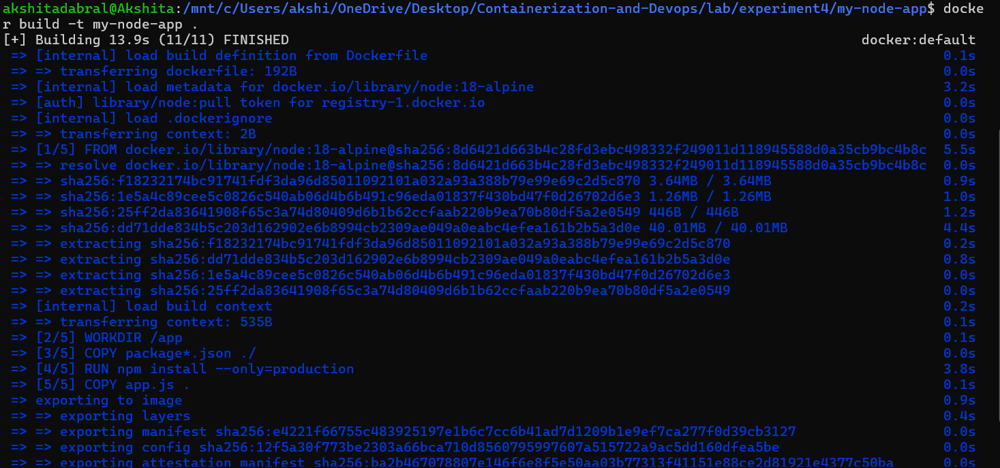

- Run container
```bash
docker run -d -p 3000:3000 -- name node-container my-node-app
```
- Test
```bash
curl http://localhost:3000
```
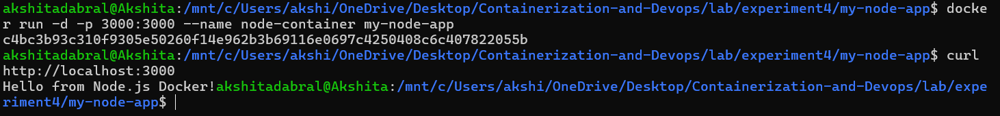