# Experiment 6 : Comparison of Docker Run and Docker Compose
## PART A – THEORY

---

## Objective

To understand the relationship between Docker run and Docker Compose, and to
compare their configuration syntax and use cases.

---

## Background Theory

**2.1 Docker Run (Imperative Approach)**

Docker Run is a command-line method used to create and start containers by specifying all configurations manually through flags. Each parameter such as port mapping, volumes, environment variables, and networking must be defined explicitly in the command.

This approach gives fine-grained control but becomes complex when dealing with multiple containers.

It requires explicit flags for:

- Port mapping (-p)
- Volume mounting (-v )
- Environment variables (-e)
- Network configuration (--network )
- Restart policies (--restart )
- Resource limits ( --memory , --cpus )
- Container name (--name)

Since instructions are written step-by-step, it follows an imperative approach.
**Example:**
```
docker run -d \
 --name my-nginx \
 -p 8080:80 \
 -v ./html:/usr/share/nginx/html \
 -e NGINX_HOST=localhost \
 --restart unless-stopped \
 nginx:alpine
```

**2.2 Docker Compose (Declarative Approach)**

Docker Compose defines containers using a YAML configuration file (docker-compose.yml). Instead of writing multiple commands, all configurations are described in a structured format.

Once defined, the application can be started with a single command.

This follows a declarative approach, where the desired state is described rather than step-by-step instructions.
---

## PART B – PRACTICAL TASK
### **TASK 1. Single Container Comparison**
**Step 1:** Run Nginx Using Docker Run

**Execute:**
```
docker run -d \
 --name lab-nginx \
 -p 8081:80 \
 -v $(pwd)/html:/usr/share/nginx/html \
 nginx:alpine
```
**Verify:**
```
docker ps
```
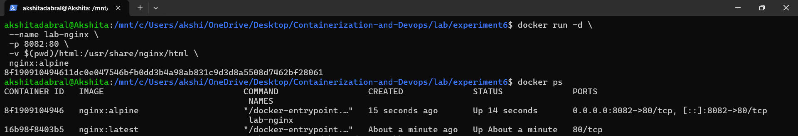

**Access:**
```
http://localhost:8082
```
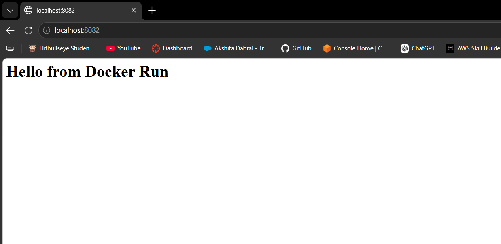

**Stop & Remove:**
```
docker stop lab-nginx
docker rm lab-nginx
```
### Step 2: Run Same Setup Using Docker Compose

**Create : [docker-compose.yml](./docker-compose.yml)**
```
version: '3.8'
services:
 nginx:
 image: nginx:alpine
 container_name: lab-nginx
 ports:
 - "8082:80"
 volumes:
 - ./html:/usr/share/nginx/html
```
**Run:**
```
docker compose up -d
```
**Verify:**
```
docker compose ps
```
**Stop:**
```
docker compose down
```

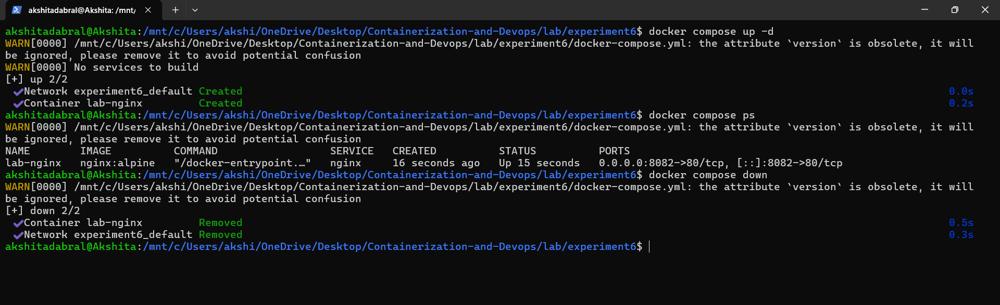

---

### **Task 2: Multi-Container Application**
**Objective:**

Deploy WordPress with MySQL using:
1. Docker Run (manual way)
2. Docker Compose (structured way)

**A. Using Docker Run**

1. **Create network**
```
docker network create wp-net
```
2. Run MySQL
```
docker run -d \
 --name mysql \
 --network wp-net \
 -e MYSQL_ROOT_PASSWORD=secret \
 -e MYSQL_DATABASE=wordpress \
 mysql:5.7
```
3. Run WordPress
```
docker run -d \
 --name wordpress \
 --network wp-net \
 -p 8082:80 \
 -e WORDPRESS_DB_HOST=mysql \
 -e WORDPRESS_DB_PASSWORD=secret \
 wordpress:latest
```
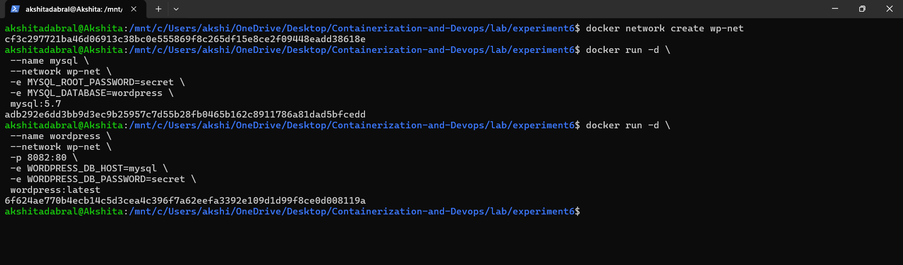

4. Open
```
http://localhost:8082
```
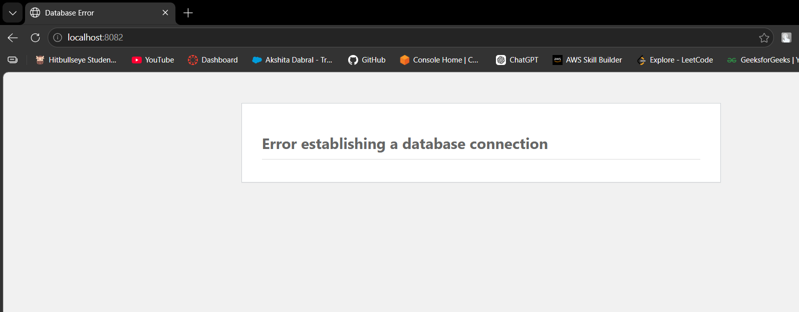

**B. Using Docker Compose**

**1. Create file**
[docker-compose1.yml](docker-compose1.yml)
```
version: '3.8'

services:
  mysql:
    image: mysql:5.7
    environment:
      MYSQL_ROOT_PASSWORD: secret
      MYSQL_DATABASE: wordpress
    volumes:
      - mysql_data:/var/lib/mysql

  wordpress:
    image: wordpress:latest
    ports:
      - "8083:80"
    environment:
      WORDPRESS_DB_HOST: mysql
      WORDPRESS_DB_PASSWORD: secret
    depends_on:
      - mysql

volumes:
  mysql_data:
```
**2. Run**
```
docker compose -f docker-compose1.yml up -d
```
**3. Stop**
```
docker compose -f docker-compose1.yml down
```
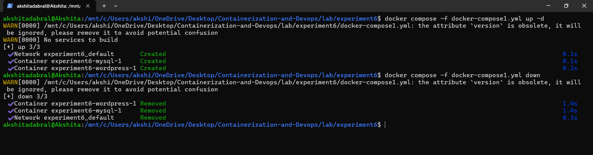

---

## PART C – CONVERSION & BUILD-BASED TASKS
### **Task 3: Convert Docker Run to Docker Compose**

**Problem 1: Basic Web Application**

**Given Docker Run Command:**
```

docker run -d \
  --name webapp \
  -p 5000:5000 \
  -e APP_ENV=production \
  -e DEBUG=false \
  --restart unless-stopped \
  node:18-alpine
  ```
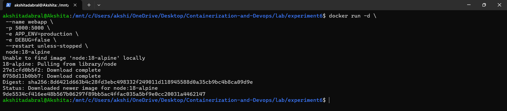

**Equivalent [docker-compose2.yml](./docker-compose2.yml):**
```
version: '3.8'

services:
  webapp:
    image: node:18-alpine
    container_name: webapp2
    ports:
      - "5000:5000"
    environment:
      APP_ENV: production
      DEBUG: "false"
    restart: unless-stopped
```
**2. Run**
```
docker compose -f docker-compose2.yml up -d
```
**3. Verify**
```
docker compose -f docker-compose2.yml ps
```
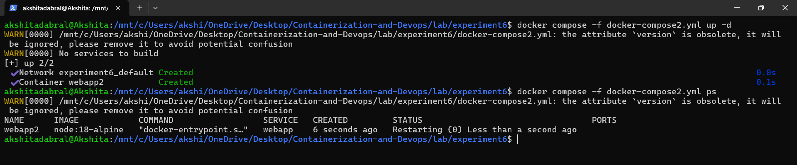

### Problem 2: Volume + Network Configuration
**Given Docker Run Commands:**
```
docker network create app-net
```
```
docker run -d \
 --name postgres-db2 \
 --network app-net \
 -e POSTGRES_USER=admin \
 -e POSTGRES_PASSWORD=secret \
 -v pgdata:/var/lib/postgresql/data \
 postgres:15
 ```
 ```
docker run -d \
 --name backend \
 --network app-net \
 -p 8000:8000 \
 -e DB_HOST=postgres-db \
 -e DB_USER=admin \
 -e DB_PASS=secret \
 python:3.11-slim
```
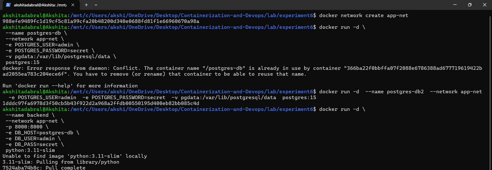

**Equivalent [docker-compose3.yml](./docker-compose3.yml):**
```
services:
  postgres-db:
    image: postgres:15
    container_name: postgres-db
    environment:
      POSTGRES_USER: admin
      POSTGRES_PASSWORD: secret
    volumes:
      - pgdata:/var/lib/postgresql/data
    networks:
      - app-net

  backend:
    image: python:3.11-slim
    container_name: backend
    ports:
      - "8084:8000"   
    environment:
      DB_HOST: postgres-db
      DB_USER: admin
      DB_PASS: secret
    depends_on:
      - postgres-db
    command: python -m http.server 8000
    networks:
      - app-net

volumes:
  pgdata:

networks:
  app-net:
  ```
**2. Run**
```
docker compose -f docker-compose3.yml up -d
```
**3. Stop**
```
docker compose -f docker-compose3.yml down
```
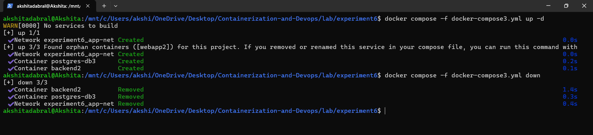

---

### Task 4: Resource Limits Conversion
**Given Docker Run Command:**
```
docker run -d \
 --name limited-app \
 -p 9000:9000 \
 --memory="256m" \
 --cpus="0.5" \
 --restart always \
 nginx:alpine
```
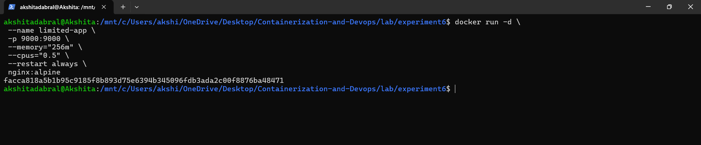

**Equivalent [docker-compose4.yml](./docker-compose4.yml):**

```
version: '3.8'

services:
  limited-app:
    image: nginx:alpine
    container_name: limited-app
    ports:
      - "9000:9000"
    restart: always
    deploy:
      resources:
        limits:
          memory: 256M
          cpus: "0.5"
```
**2. Run**
```
docker compose -f docker-compose4.yml up -d
```
**3. Stop**
```
docker compose -f docker-compose4.yml down
```
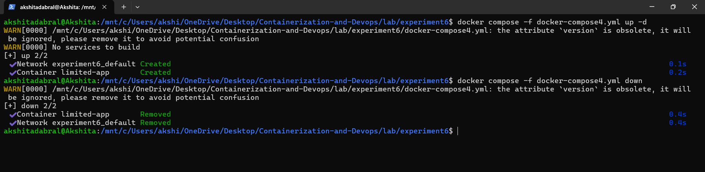

---

## PART D – USING DOCKERFILE INSTEAD OF STANDARD IMAGE
### **Task 5: Replace Standard Image with Dockerfile (Node App)**

**1. Create project folder**
```
mkdir node-docker-lab
cd node-docker-lab
```
**2. Create [app.js](./node-docker-lab/app.js)**

```

const http = require('http');

http.createServer((req, res) => {
    res.end("Docker Compose Build Lab");
}).listen(3000);
```
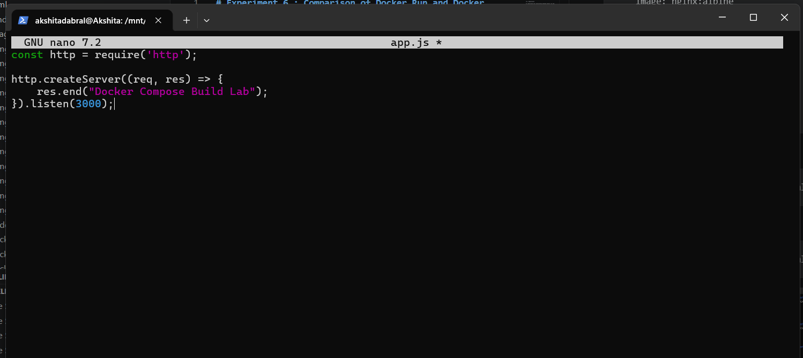


**3. Create [Dockerfile](./node-docker-lab/Dockerfile)**
```
FROM node:18-alpine

WORKDIR /app

COPY app.js .

EXPOSE 3000

CMD ["node", "app.js"]
```
**4. Create [docker-compose.yml](./node-docker-lab/docker-compose.yml)**
```
version: '3.8'
services:
 nodeapp:
 build:
 context: .
 dockerfile: Dockerfile
 container_name: custom-node-app
 ports:
 - "3000:3000"
```


**5. Build and run**
```
docker compose up --build -d
```
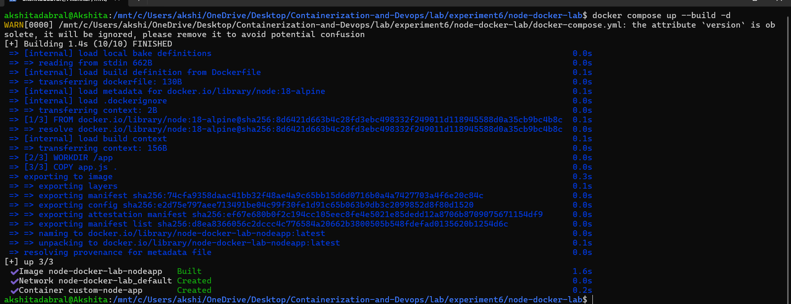

**6. Check output**
```
http://localhost:3000
```
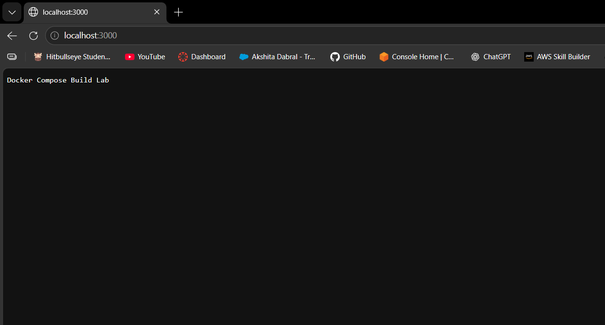

**7. Modify app.js**

- The app.js file was updated with a new response message:

- **Change**: res.end("Docker Compose Build Lab");

- **To:** 
res.end("Modified Message - Docker Rebuild Success");

**8. Rebuild container**

- The following command was executed to rebuild and restart the container:
```
docker compose up --build -d
```
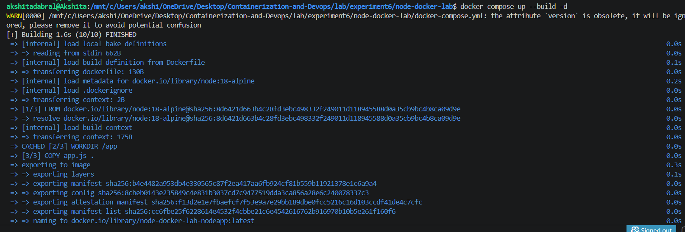


**9. Verify**

- The updated output was successfully verified in the browser at:

- Open: http://localhost:3000

-  You should see updated message
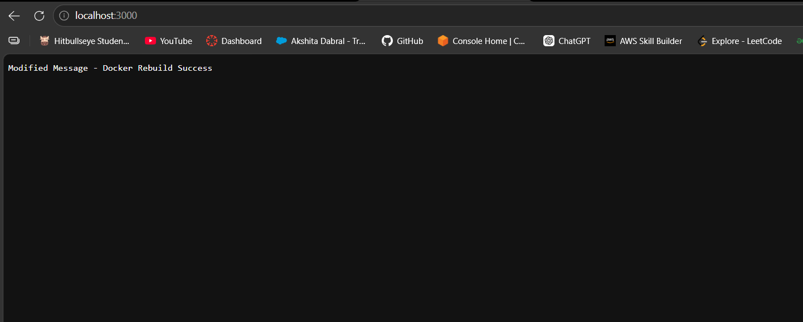

This demonstrated that whenever source code changes are made, the Docker image must be rebuilt so that containers use the latest version of the application.

## Difference between Image and Build:

- **Image:**
→ Uses prebuilt image from Docker Hub
→ Fast but no customization

- **Build:**
→ Creates custom image using Dockerfile
→ Allows adding your own code

---
## TASK 6: Multi-Stage Dockerfile (IMPORTANT + HIGH MARKS)

### Objective

To create a production-ready Node.js application using a Multi-Stage Dockerfile and deploy it using Docker Compose. This experiment demonstrates image optimization, reduced image size, and efficient deployment.

**1. Create new folder**
```
mkdir multi-stage-app
cd multi-stage-app
```

**2. Create [app.js](./multi-stage-app/app.js)
**
A simple Node.js HTTP server was created in app.js

```
const http = require('http');

http.createServer((req, res) => {
    res.end("Production Multi-Stage App");
}).listen(3000);
```

**3. Multi-stage Dockerfile**

A Multi-Stage Dockerfile was created to optimize the final image.
```
FROM node:18-alpine AS builder

WORKDIR /app
COPY app.js .

# Final smaller image
FROM node:18-alpine

WORKDIR /app
COPY --from=builder /app .

EXPOSE 3000
CMD ["node", "app.js"]
```
- The first stage acts as the builder stage.
- The second stage creates the final lightweight production image.
- Only required files are copied into the final image.

**4. Create [docker-compose.yml](./multi-stage-app/docker-compose.yml)**
```
version: '3.8'

services:
  app:
    build:
      context: .
      dockerfile: Dockerfile
    container_name: multi-stage-app
    ports:
      - "3001:3000"
    environment:
      NODE_ENV: production
    volumes:
      - .:/app   # dev mode
  ```

**5. Run**
```
docker compose up --build -d
```
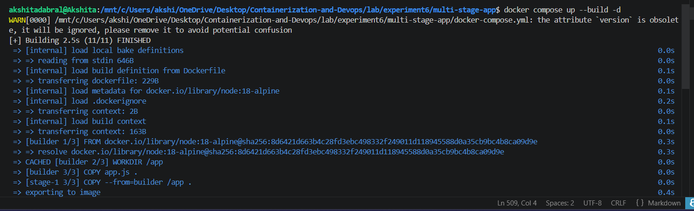

**6. Verify**

```
http://localhost:3001
```
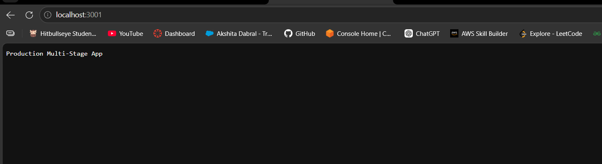

### Result

- The Multi-Stage Docker application was successfully created and deployed using Docker Compose.

### Advantages of Multi-Stage Dockerfile
- Reduces final image size
- Faster deployment
- Better security
- Suitable for production use
- Cleaner Docker builds

---

## Experiment 6 B: Multi-Container Application using Docker Compose (WordPress + Database)**

**1. Objective**

To deploy a multi-container application using Docker Compose, consisting of:
WordPress (frontend + PHP)
MySQL database (backend)
Also:
Understand container networking & volumes
Learn how to scale services
Compare with Docker Swarm for production deployment

**2. Prerequisites**

- Docker installed
- Docker Compose (comes with modern Docker)
- Basic understanding of containers

## STEPS

1. Create [folder](./wp-compose-lab/)
```
mkdir wp-compose-lab
cd wp-compose-lab
```

2. Create docker-compose.yml

```
version: '3.9'

services:
  db:
    image: mysql:5.7
    container_name: wordpress_db
    restart: always
    environment:
      MYSQL_ROOT_PASSWORD: rootpass
      MYSQL_DATABASE: wordpress
      MYSQL_USER: wpuser
      MYSQL_PASSWORD: wppass
    volumes:
      - db_data:/var/lib/mysql

  wordpress:
    image: wordpress:latest
    depends_on:
      - db
    ports:
      - "8085:80"
    restart: always
    environment:
      WORDPRESS_DB_HOST: db:3306
      WORDPRESS_DB_USER: wpuser
      WORDPRESS_DB_PASSWORD: wppass
      WORDPRESS_DB_NAME: wordpress
    volumes:
      - wp_data:/var/www/html

volumes:
  db_data:
  wp_data:

  ```

**3. Run**
```
docker compose up -d
```
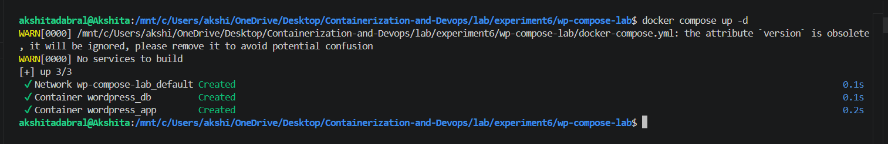

**4. Verify**
```
docker ps
```
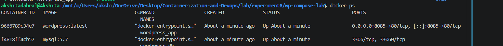

**5. Open**
```
http://localhost:8085

```

The WordPress installation page opened successfully.

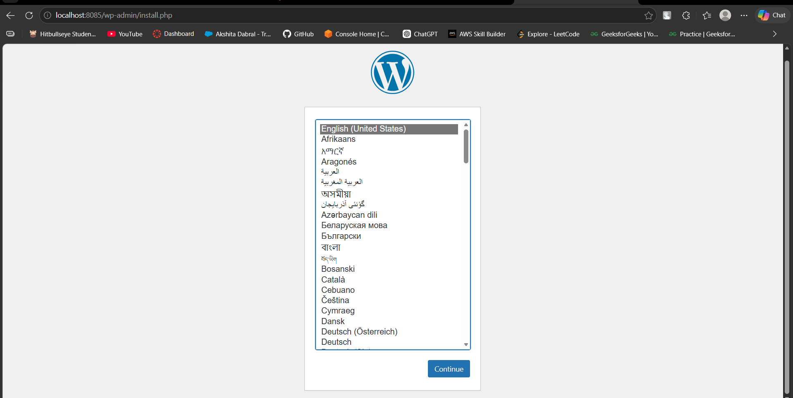

**6. Check volumes**
```
docker volume ls

```
This confirmed persistent storage creation.
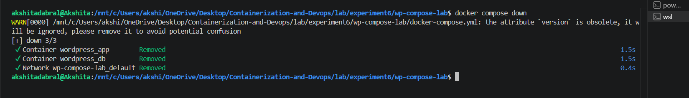

## SCALING TEST

WordPress containers were scaled using:
```
docker compose up --scale wordpress=3
```
**- Problems Observed**

- Port conflict
- No load balancing

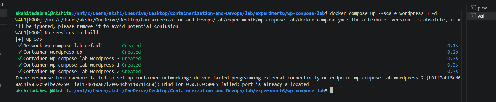

- **Adding Nginx Reverse Proxy**

```
version: '3.9'

services:
  db:
    image: mysql:5.7
    container_name: wordpress_db
    restart: always
    environment:
      MYSQL_ROOT_PASSWORD: rootpass
      MYSQL_DATABASE: wordpress
      MYSQL_USER: wpuser
      MYSQL_PASSWORD: wppass
    volumes:
      - db_data:/var/lib/mysql

  wordpress:
    image: wordpress:latest
    depends_on:
      - db
    restart: always
    environment:
      WORDPRESS_DB_HOST: db:3306
      WORDPRESS_DB_USER: wpuser
      WORDPRESS_DB_PASSWORD: wppass
      WORDPRESS_DB_NAME: wordpress
    volumes:
      - wp_data:/var/www/html

  nginx:
    image: nginx:latest
    ports:
      - "8085:80"
    depends_on:
      - wordpress

volumes:
  db_data:
  wp_data:
  ```
**1. Then containers were restarted**
```
docker compose up --scale wordpress=3 -d
```
Now requests passed through Nginx.

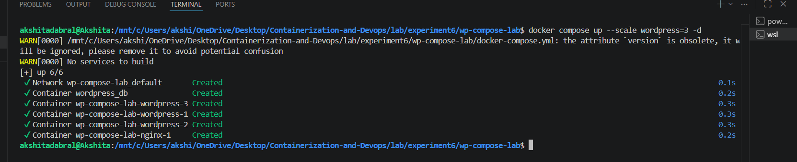

**2. Access system**

```
http://localhost:8085
```

- Now request goes through Nginx


3. Limitations of Docker Compose
- No built-in load balancing
- No auto-healing
- Single host only
- Not production-ready for scaling

##  Running Same Setup with Docker Swarm

**1. Initialize Swarm**
```
docker swarm init
```

This converted the machine into a Swarm manager node.
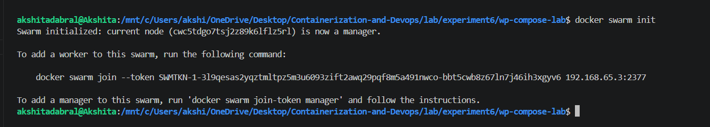

**2. Deploy Stack**
```
docker stack deploy -c docker-compose.yml wpstack
```
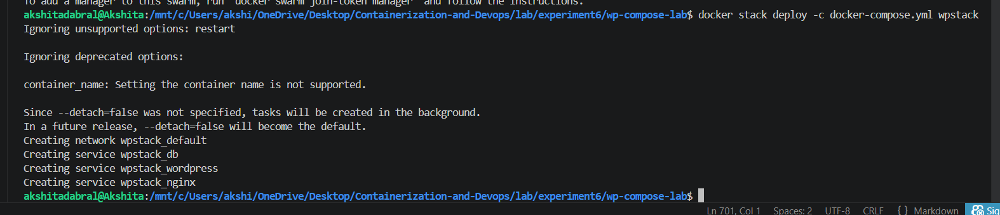

**3.  Scale Service**

```
docker service scale wpstack_wordpress=3
```
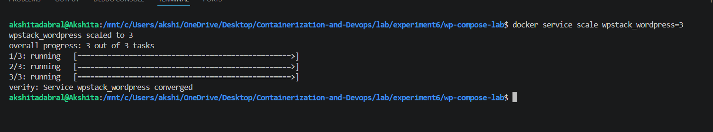


**4. Verify scaling**
```
docker service ps wpstack_wordpress
```
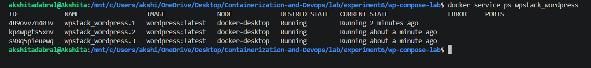

**7. Benefits of Docker Swarm**
- Built-in load balancing
- Automatic container restart (self-healing)
- Horizontal scaling across nodes
- Rolling updates without downtime
- Service abstraction (not individual containers)

**8. Challenges / Limitations of Swarm**
- Less popular than Kubernetes
- Limited ecosystem
- Less flexible scheduling
- Fewer enterprise features

---

### Result

The WordPress and MySQL multi-container application was successfully deployed using Docker Compose. Scaling limitations were observed, and Docker Swarm provided a better production-ready orchestration solution.

---

### Conclusion

This experiment demonstrated the deployment of multi-container applications using Docker Compose, use of persistent volumes, container communication through networking, scaling challenges in Compose, and the advantages of Docker Swarm such as load balancing, self-healing, and scalable production deployments.

---