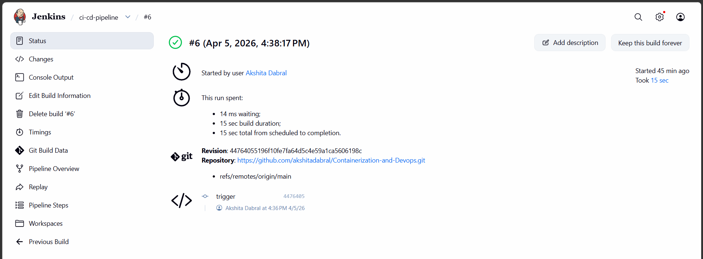

# Lab Experiment 7: CI/CD using Jenkins, GitHub and Docker Hub

## 1. Aim
To design and implement a complete CI/CD pipeline using Jenkins, integrating source
code from GitHub, and building & pushing Docker images to Docker Hub.

## 2. Objectives
- Understand CI/CD workflow using Jenkins (GUI-based tool)
- Create a structured GitHub repository with application + Jenkinsfile
- Build Docker images from source code
- Securely store Docker Hub credentials in Jenkins
- Automate build & push process using webhook triggers
- Use same host (Docker) as Jenkins agent

## 3. Theory

### What is Jenkins?
Jenkins is a web-based GUI automation server used to:
- Build applications
- Test code
- Deploy software

### What is CI/CD?

- **Continuous Integration (CI):**
Code is automatically built and tested after each commit
Jenkinsfile
- **Continuous Deployment (CD):**
Built artifacts (Docker images) are automatically delivered/deployed
- **Workflow Overview :**

Developer → GitHub → Webhook → Jenkins → Build → Docker Hub

## 4. Prerequisites
- Docker & Docker Compose installed
- GitHub account
- Docker Hub account
- Basic Linux command knowledge

---

### STEP 1 : Create Repository

**Create a repository on GitHub:**
```
mkdir my-app
cd my-app
```
**Create files**

1. #### [app.py](./app.py)
```
from flask import Flask
app = Flask(__name__)

@app.route("/")
def home():
    return "Hello from CI/CD Pipeline!"

app.run(host="0.0.0.0", port=80)
```
2. #### [requirements.txt](./requirements.txt)
```
flask
```
3. #### [Dockerfile](./Dockerfile)
```
FROM python:3.10-slim
WORKDIR /app
COPY . .
RUN pip install -r requirements.txt
EXPOSE 80
CMD ["python", "app.py"]
```
#### Build Process Explanation
- Source code pushed to GitHub
- Jenkins pulls code
- Dockerfile:
Creates environment
Installs dependencies
Packages app
- Output → Docker Image

4. #### [Jenkinsfile](./Jenkinsfile)


```
pipeline {
    agent any

    environment {
        IMAGE_NAME = "akshitadabral/myapp"
    }

    stages {

        stage('Check Docker') {
            steps {
                sh 'docker --version'
            }
        }

        stage('Build Docker Image') {
            steps {
                dir('lab/experiment7/my-app') {
                    sh 'docker build -t $IMAGE_NAME:latest .'
                }
            }
        }

        stage('Login to Docker Hub') {
            steps {
                withCredentials([string(credentialsId: 'dockerhub-token', variable: 'DOCKER_TOKEN')]) {
                    sh '''
                    echo $DOCKER_TOKEN | docker login -u akshitadabral --password-stdin
                    '''
                }
            }
        }

        stage('Push to Docker Hub') {
            steps {
                sh 'docker push $IMAGE_NAME:latest'
            }
        }
    }
}
```
---

### STEP 2 : Jenkins Setup using Docker 

**1. Create [docker-compose.yml](./docker-compose.yml)**
```
services:
  jenkins:
    image: jenkins/jenkins:lts
    container_name: jenkins
    restart: always
    ports:
      - "8081:8080"   # IMPORTANT
      - "50000:50000"
    volumes:
      - jenkins_home:/var/jenkins_home
      - /var/run/docker.sock:/var/run/docker.sock
    user: root

volumes:
  jenkins_home:
```

- **Start Jenkins**
```
docker-compose up -d
```
.png)

- **Verify**
```
docker ps
```
.png)

- **Open Jenkins**

```
http://localhost:8081
```
.png)

- **Unlock Jenkins**
```
docker exec -it jenkins cat /var/jenkins_home/secrets/initialAdminPassword
```


1. Enter the password

2. Install suggested plugins

3. Create admin user
.png)

---

### STEP 3 : Jenkins Configuration

**1. Add Docker Hub Credentials**
- Path:
Manage Jenkins → Credentials → Add Credentials
- Type: Secret Text
- ID: dockerhub-token
- Value: Docker Hub Access Token

.png)
.png)


**2. Create Pipeline**

1. New Item → Pipeline

2. Name: ci-cd-pipeline

3. Configure: Pipeline script from SCM

- SCM: Git
- Repo URL: your GitHub repo
- Script Path: Jenkinsfile

.png)
.png)

**3. Run Pipeline**

- Click: Build Now

**4: Watch Execution**

Click the build → Console Output
.png)

**5. Verify Docker Hub**

Go to Docker Hub and check for: **akshitadabral/myapp**

.png)

---

### STEP 4 : GitHub Webhook Integration

**1. Configure Webhook in GitHub**

**In GitHub:** Repository Settings → Webhooks → Add Webhook

- **Payload URL**: http://192.168.29.11:8080/github-webhook/
- **Content type:** application/x-www-form-urlencoded
- **Events:** Push event
.png)

**2. Enable Trigger in Jenkins**

- **Go to:** ci-cd-pipeline → Configure

- **Select:** GitHub hook trigger for GITScm polling

- **Save**
.png)

**3. Test Webhook Trigger**

Push an empty commit to verify the webhook triggers a Jenkins build automatically:
```
git commit --allow-empty -m "trigger"
git push
```
.png)

---

### STEP 5: Execution Flow & Verification
**1. Pipeline Execution**

Jenkins receives the webhook event and executes all stages:

1. Clone – Pulls latest code from GitHub
2. Build – Docker builds image using Dockerfile
3. Auth – Jenkins logs into Docker Hub using stored token
4. Push – Image pushed to Docker Hub



**2. Console Output**

Jenkins console output showing pipeline stages:

.png)

**3. Docker Hub Verification**

**akshitadabral/myapp** image pushed to Docker Hub:

.png)