# Experiment 9 : Ansible

## Aim

To understand and implement infrastructure automation using Ansible by configuring multiple servers through playbooks in an agentless environment.

---

## Objectives
- To understand the working of Ansible and its architecture
- To automate server configuration using YAML-based playbooks
- To manage multiple servers efficiently using an inventory file
- To implement SSH-based communication without agents
- To perform real-time configuration using Docker containers as servers

---

## **Theory**

**Problem Statement:** Managing infrastructure manually across multiple servers leads to configuration drift, inconsistent
environments, and time-consuming repetitive tasks. Scaling from one server to hundreds becomes nearly impossible with
manual SSH-based administration.

**What is Ansible?**

- Ansible is an open-source automation tool for configuration management, application deployment, and
orchestration.
- It follows an agentless architecture, using SSH for Linux and WinRM for Windows.
- Uses YAML-based playbooks to define automation tasks.

Ansible is software that enables cross-platform automation and orchestration at scale and has become the standard
choice among enterprise automation solutions.

**How Ansible Solves the Problem:**

- Agentless Architecture: No software installation required on managed nodes
- Idempotency: Running playbooks multiple times yields same result
- Declarative Syntax: Describe desired state, not the steps to achieve it
- Push-based: Initiates changes from control node immediately

---

## PART 1: Ansible Installation Instructions

**1. Install Ansible**
```
sudo apt update -y
sudo apt install ansible -y
```
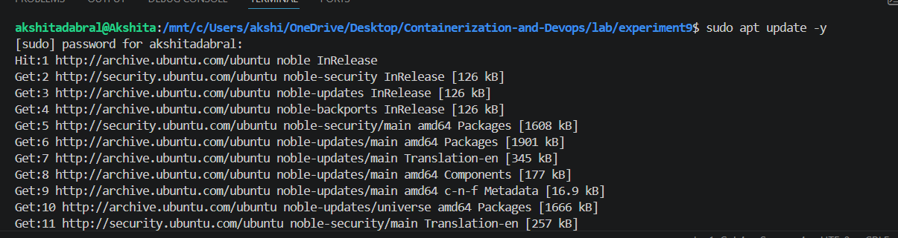
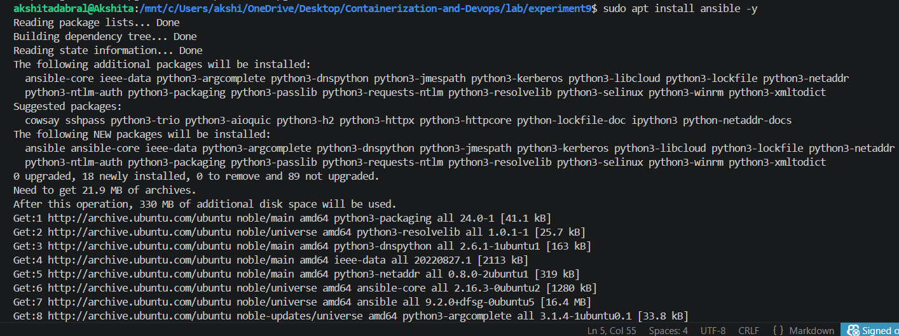
**2. Verify installation**
```
ansible --version
```
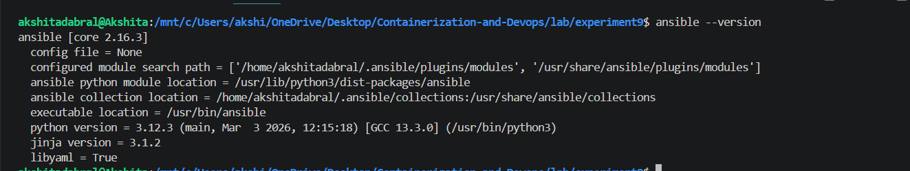

**3. Post-Installation Check**
```
ansible localhost -m ping
```

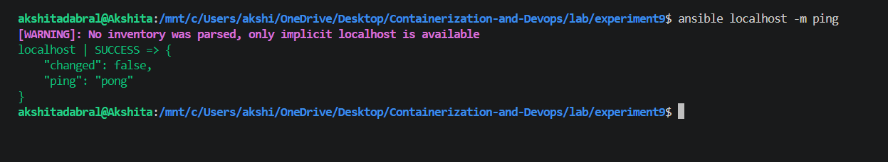

---
## PART 2: Create SSH Key Pair
We first generate an SSH key pair using ssh-keygen.

**This step creates:**
```
A private key (id_rsa)
A public key (id_rsa.pub)
```
The private key stays on the control machine, while the public key is copied to the servers.
```
ssh-keygen -t rsa -b 4096
```

**Files created:**
```
Private key → ~/.ssh/id_rsa

Public key → ~/.ssh/id_rsa.pub
```
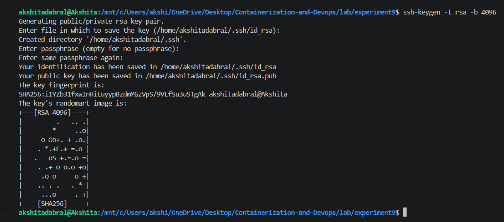

---
## PART 3: Prepare Docker SSH Server
**1. Copy keys to working folder**

Copies SSH keys into the current directory so they can be added to the container.
```
cp ~/.ssh/id_rsa .
cp ~/.ssh/id_rsa.pub .
```
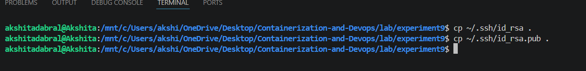

**2. Create [Dockerfile](./Dockerfile)**

- Creates a Docker image with Ubuntu, SSH server, and Python installed.
- Configures SSH for key-based authentication and enables root login.
- Adds the public key to allow secure access.
```
FROM ubuntu

RUN apt update -y
RUN apt install -y python3 python3-pip openssh-server

RUN mkdir -p /var/run/sshd

# Configure SSH
RUN mkdir -p /run/sshd && \
 echo 'root:password' | chpasswd && \
 sed -i 's/#PermitRootLogin prohibit-password/PermitRootLogin yes/' /etc/ssh/sshd_config && \
 sed -i 's/#PasswordAuthentication yes/PasswordAuthentication no/' /etc/ssh/sshd_config && \
 sed -i 's/#PubkeyAuthentication yes/PubkeyAuthentication yes/' /etc/ssh/sshd_config

# Setup SSH keys
RUN mkdir -p /root/.ssh && chmod 700 /root/.ssh

COPY id_rsa /root/.ssh/id_rsa
COPY id_rsa.pub /root/.ssh/authorized_keys

RUN chmod 600 /root/.ssh/id_rsa && \
 chmod 644 /root/.ssh/authorized_keys

RUN sed -i 's@session\s*required\s*pam_loginuid.so@session optional pam_loginuid.so@g' /etc/pam.d/sshd

EXPOSE 22

CMD ["/usr/sbin/sshd", "-D"]
```

**3. Build Docker Image**
```
docker build -t ubuntu-server .
```
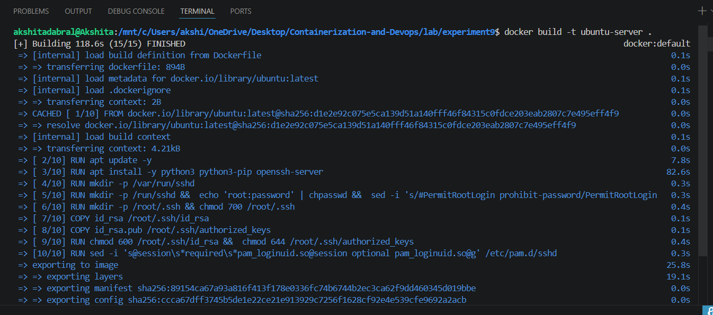

**4. Run Test Container (For SSH Check)**

Starts a container and maps port 2222 for SSH access.
```
docker run -d -p 2222:22 --name ssh-test-server ubuntu-server
```
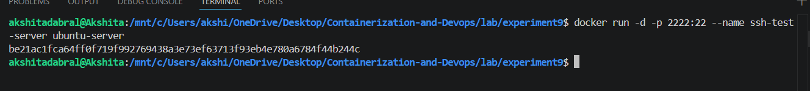


**5. Get Container IP**
```
docker inspect -f '{{range.NetworkSettings.Networks}}{{.IPAddress}}{{end}}' ssh-test-server
```
**6. Test SSH Connection**

Checks if SSH login using the key is working correctly.
```
ssh -i ~/.ssh/id_rsa root@localhost -p 2222
```
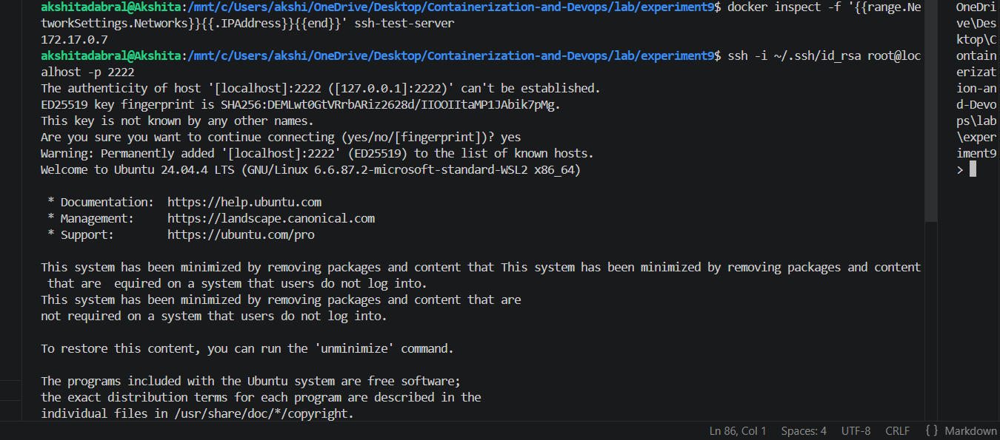

**7. Stop Test Container**

Removes the test container after verification.
```
docker rm -f ssh-test-server
```

---
## PART 4: Run Multiple Servers

Creates multiple containers acting as separate servers on different ports.

```
for i in {1..4}; do
 docker run -d -p 220${i}:22 --name server${i} ubuntu-server
done

```
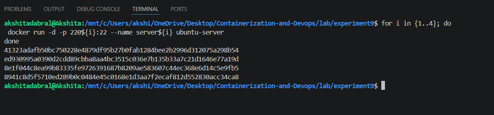

---
## PART 5: Create Inventory File

**1. Create Inventory File**

- [inventory.ini](./inventory.ini)

Defines all servers and their connection details for Ansible.
Specifies host, port, user, SSH key, and Python interpreter.

```
[servers]
server1 ansible_host=localhost ansible_port=2201
server2 ansible_host=localhost ansible_port=2202
server3 ansible_host=localhost ansible_port=2203
server4 ansible_host=localhost ansible_port=2204

[servers:vars]
ansible_user=root
ansible_ssh_private_key_file=~/.ssh/id_rsa
ansible_python_interpreter=/usr/bin/python3

```
---

## PART 6: Test Connectivity
- Checks if all servers are reachable using Ansible.
- Verifies SSH connection and configuration are working correctly.
```
ansible all -i inventory.ini -m ping
```
or
```
ansible all -i inventory.ini -m ping --ssh-common-args='-o StrictHostKeyChecking=no'
```
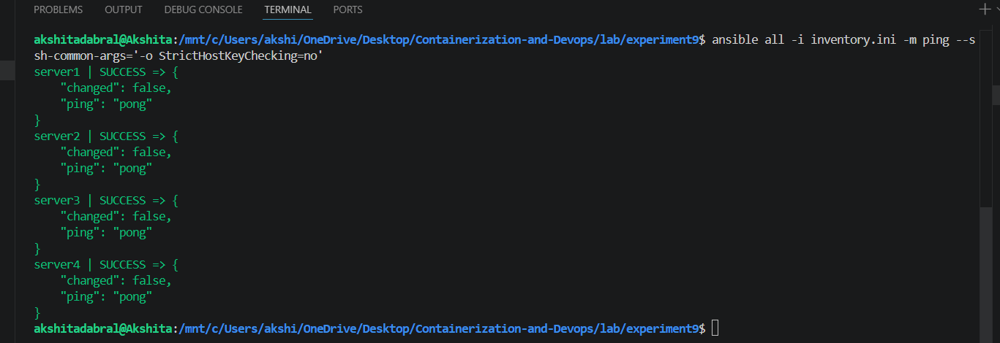

---
## PART 7: Create Playbook
- [playbook.yml](./playbook.yml)

- Defines automation tasks to update system packages, install tools, and create a file on all servers.

```

---
- name: Configure servers
  hosts: servers
  become: yes

  tasks:
    - name: Update packages
      apt:
        update_cache: yes
        upgrade: dist

    - name: Install packages
      apt:
        name:
          - vim
          - htop
          - wget
        state: present

    - name: Create test file
      copy:
        dest: /root/ansible_test.txt
        content: "Configured by Ansible on {{ inventory_hostname }}"

```

---

## PART 8: Run Playbook
Executes the playbook on all servers defined in the inventory file.
```
ansible-playbook -i inventory.ini playbook.yml
```
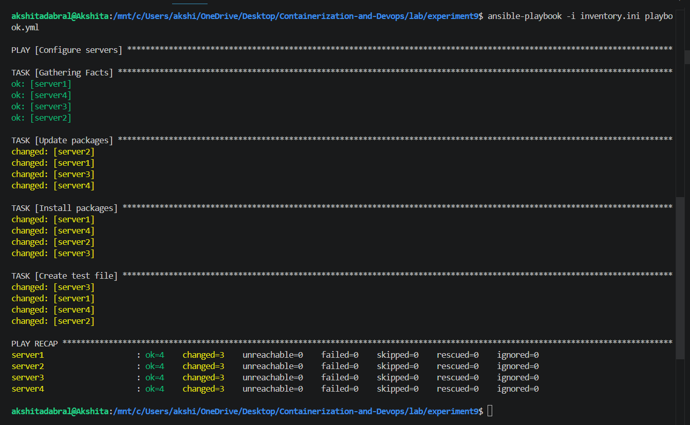

---

## PART 9: Verify Output
Checks the created file on all servers to confirm successful execution.
```
ansible all -i inventory.ini -m command -a "cat /root/ansible_test.txt"
```
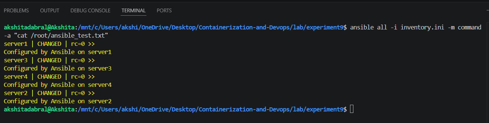
---
## PART 10: Try this playbook also
- Adds more automation tasks including system info and disk usage display.
- [playbook1.yml](./playbook1.yml)
```
---
- name: Configure multiple servers
  hosts: servers
  become: yes

  tasks:
    - name: Update apt package index
      apt:
        update_cache: yes

    - name: Install Python 3 (latest available)
      apt:
        name: python3
        state: latest

    - name: Create test file with content
      copy:
        dest: /root/test_file.txt
        content: |
          This is a test file created by Ansible
          Server name: {{ inventory_hostname }}
          Current date: {{ ansible_date_time.date }}

    - name: Display system information
      command: uname -a
      register: uname_output

    - name: Show disk space
      command: df -h
      register: disk_space

    - name: Print results
      debug:
        msg:
          - "System info: {{ uname_output.stdout }}"
          - "Disk space: {{ disk_space.stdout_lines }}"
```
**2. Run playbook**
```
ansible-playbook -i inventory.ini playbook1.yml
```
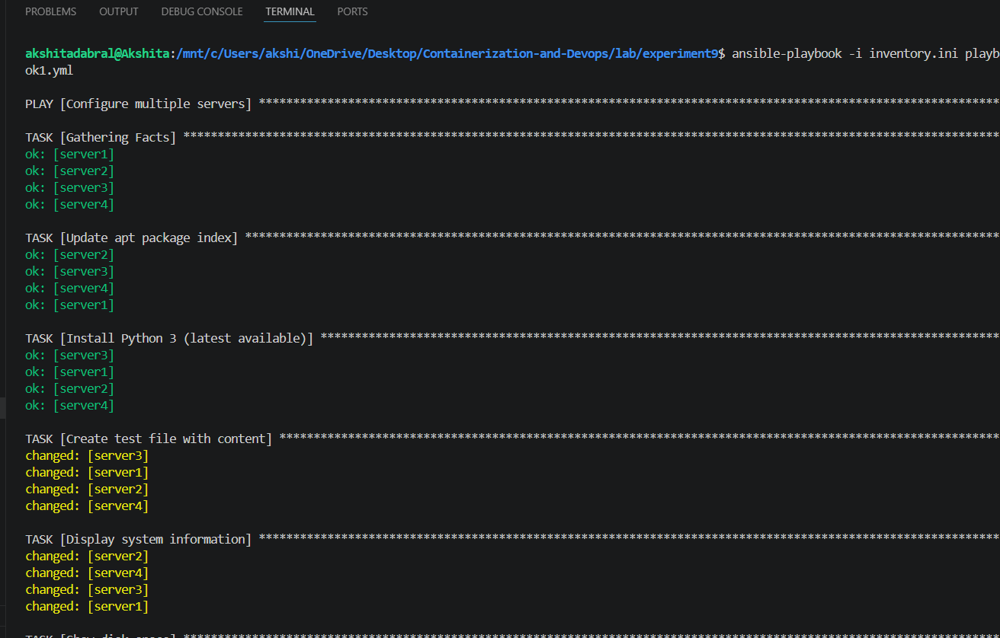

**3. Verify output**
```
ansible all -i inventory.ini -m command -a "cat /root/test_file.txt"

```
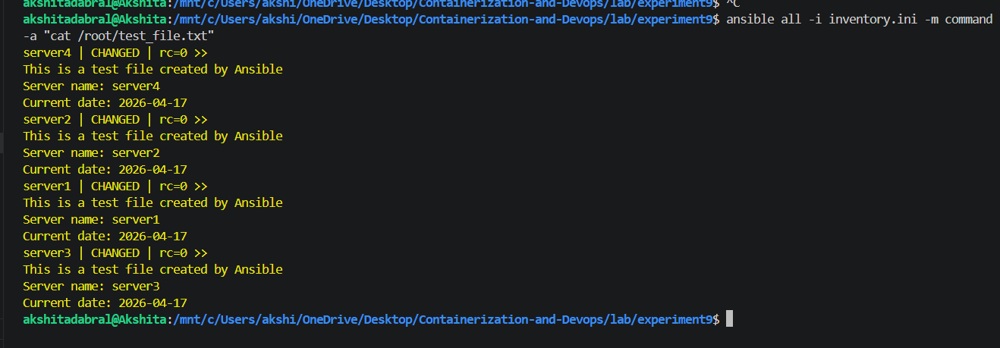
---
## PART 11: Cleanup
Removes all running containers to clean up the environment.

```
for i in {1..4}; do
 docker rm -f server${i}
done
```
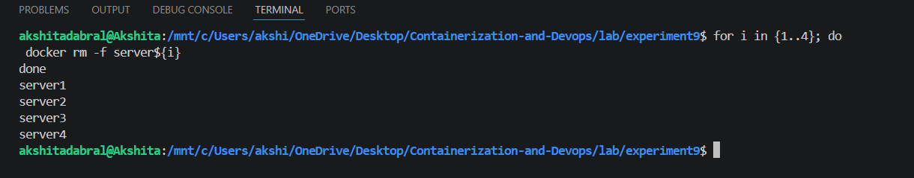

---

## Observations
- Ansible successfully connected to multiple servers using SSH
- Playbooks executed tasks simultaneously on all nodes
- No agent installation was required on target systems
- Automation reduced manual effort significantly
- YAML syntax made playbooks easy to read and write

---

## Result

The experiment was successfully completed. Multiple Docker-based servers were configured using Ansible playbooks, demonstrating efficient, scalable, and automated infrastructure management.

---

## Conclusion

Ansible provides a simple yet powerful way to automate server configuration. Its agentless architecture, ease of use, and scalability make it an ideal tool for managing large infrastructures efficiently. This experiment demonstrated how repetitive administrative tasks can be automated reliably using playbooks.

