## Assignment-1:- Containerized Web Application with PostgreSQL using Docker Compose and Macvlan/Ipvlan

<hr>

<h4 align="center"> Pre-requisite </h4>

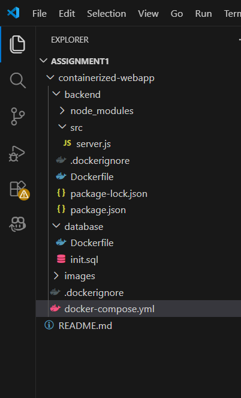

<hr>

**Step-1:- Initialize a Node Package**
```bash
npm init -y
```


**Step-2:- Install Necessary Package**
```bash
npm i express pg
```
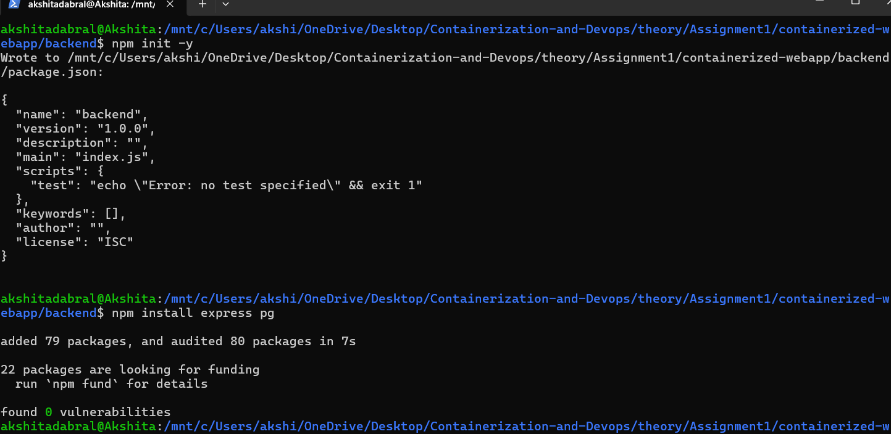


**Step-3:- The `package.json` will look as follows:-**
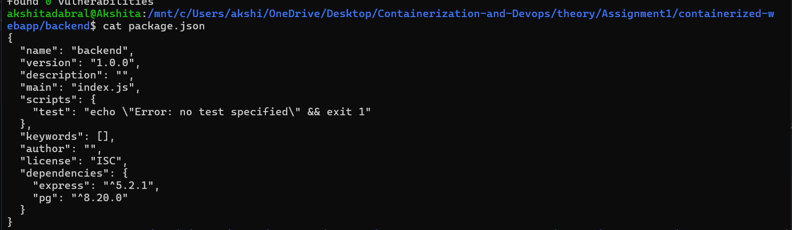


**Step-4:- The `server.js` will look as follows:-**
```js
const express = require("express");
const { Pool } = require("pg");


const app = express();
app.use(express.json());

const pool = new Pool({
  host: process.env.DB_HOST,
  user: process.env.POSTGRES_USER,
  password: process.env.POSTGRES_PASSWORD,
  database: process.env.POSTGRES_DB,
  port: 5432
});

async function initDB() {
  await pool.query(`
    CREATE TABLE IF NOT EXISTS users(
        id SERIAL PRIMARY KEY,
        name TEXT
    )
  `);
}

initDB();

app.get("/health", (req, res) => {
  res.send("Server healthy");
});

app.post("/users", async (req, res) => {
  const { name } = req.body;

  const result = await pool.query(
    "INSERT INTO users(name) VALUES($1) RETURNING *",
    [name]
  );

  res.json(result.rows[0]);
});

app.get("/users", async (req, res) => {
  const result = await pool.query("SELECT * FROM users");
  res.json(result.rows);
});

app.listen(3000, "0.0.0.0", () => {
  console.log("Server running on port 3000");
});
```
[server.js](./containerized-webapp/backend/src/server.js)


**Step-5:- The backend/`Dockerfile` will look as follows:-**
```Dockerfile
# Builder Stage
FROM node:20-alpine AS builder

WORKDIR /app

COPY package*.json ./

RUN npm install --only=production

COPY . .

# Runtime Stage
FROM node:20-alpine

WORKDIR /app

RUN addgroup -S appgroup && adduser -S appuser -G appgroup

COPY --from=builder /app .

USER appuser

EXPOSE 3000

CMD ["node", "src/server.js"]
```
[Dockerfile of backend](./containerized-webapp/backend/Dockerfile)


**Step-6:- The `.dockerignore` will look as follows:-**
```bash
node_modules
npm-debug.log
Dockerfile
.git
.gitignore
````


**Step-7:- The database/`Dockerfile` will look as follows:-**
```Dockerfile
FROM postgres:15-alpine

COPY init.sql /docker-entrypoint-initdb.d/
```


**Step-8:- The `init.sql` will look as follows:-**
```sql
CREATE TABLE IF NOT EXISTS users(
    id SERIAL PRIMARY KEY,
    name TEXT
);
```


**Step-9:- The `docker-compose.yml` will look as follows:-**
```docker-compose
version: "3.9"

services:

  database:
    build: ./database
    container_name: postgres_db
    restart: always

    environment:
      POSTGRES_DB: mydb
      POSTGRES_USER: admin
      POSTGRES_PASSWORD: akshita

    volumes:
      - pgdata:/var/lib/postgresql/data

    networks:
      macvlan_net:
        ipv4_address: 192.168.50.21

    healthcheck:
      test: ["CMD-SHELL", "pg_isready -U admin"]
      interval: 10s
      retries: 5


  backend:
    build: ./backend
    container_name: node_backend
    restart: always

    environment:
      DB_HOST: 192.168.50.21
      POSTGRES_DB: mydb
      POSTGRES_USER: admin
      POSTGRES_PASSWORD: akshita
    depends_on:
      database:
        condition: service_healthy

    networks:
      macvlan_net:
        ipv4_address: 192.168.50.20


volumes:
  pgdata:

networks:
  macvlan_net:
    external: true
```
[docker-compose.yml](./containerized-webapp/docker-compose.yml)


**Step-10:- Find your interface**
```bash
ip a
```


**Step-11:- Create Network**
```bash
docker network create -d macvlan \
  --subnet=192.168.50.0/24 \
  --gateway=192.168.50.1 \
  -o parent=eth0 \
  macvlan_net
```
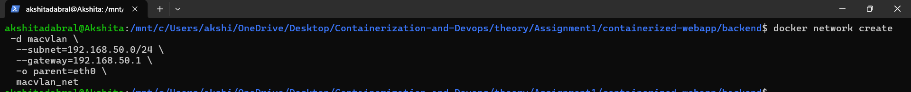


**Step-12:- Build from Compose**
```bash
docker-compose build --no-cache
```
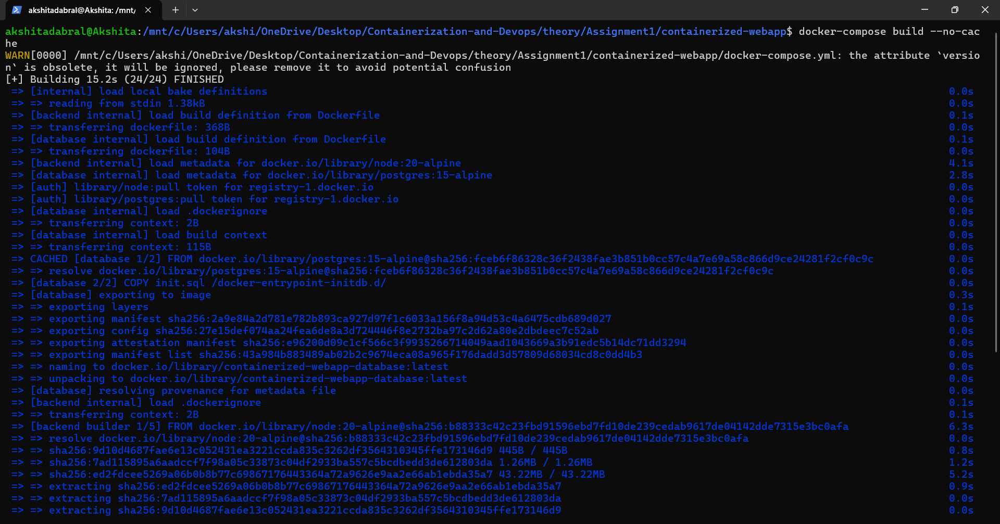


**Step-13:- Start Services**
```bash
docker-compose up -d
```
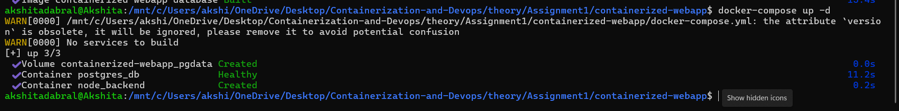


**Step-14:- Insert A User in DB in API**
```bash
curl -X POST http://192.168.50.20:3000/users \
-H "Content-Type: application/json" \
-d '{"name":"Akshita"}'
```
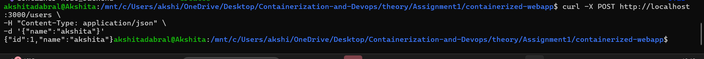


**Step-15:- GET User API**
```bash
curl http://192.168.50.20:3000/users
```


**Step-16:- List Running Container**
```bash
docker ps
```
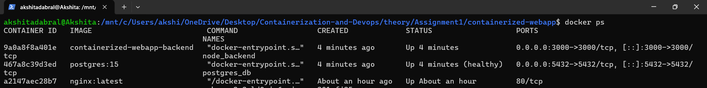


**Step-17:- List Volumes**
```bash
docker volume ls 
```
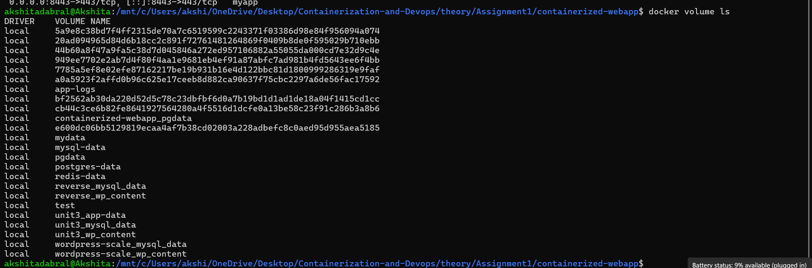


**Step-18:- Inspect Network**
```bash
docker network inspect macvlan_net
```
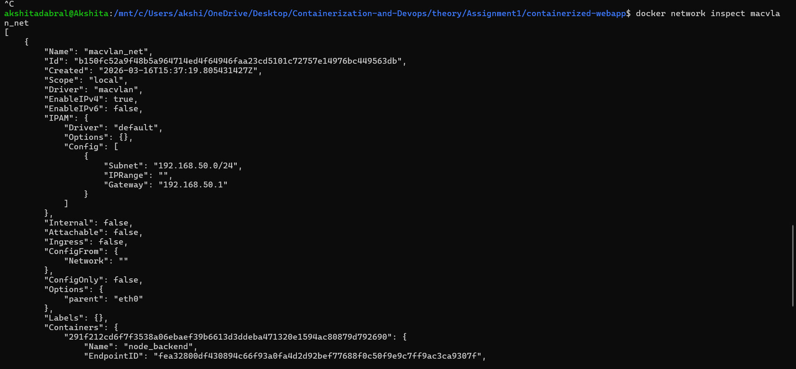


**Step-19:- Inspect Backend Container**
```bash
docker inspect node_backend
```
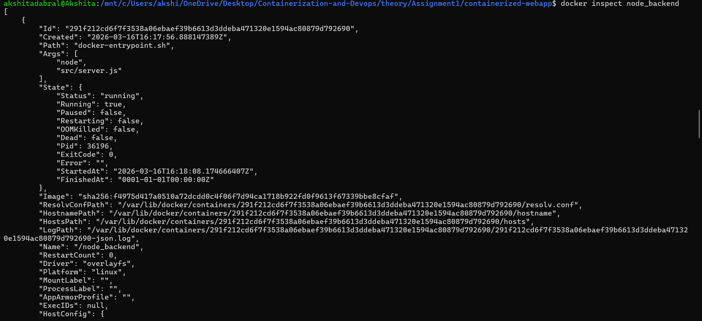


**Step-20:- Inspect DB**
```bash
docker inspect postgres_db
```
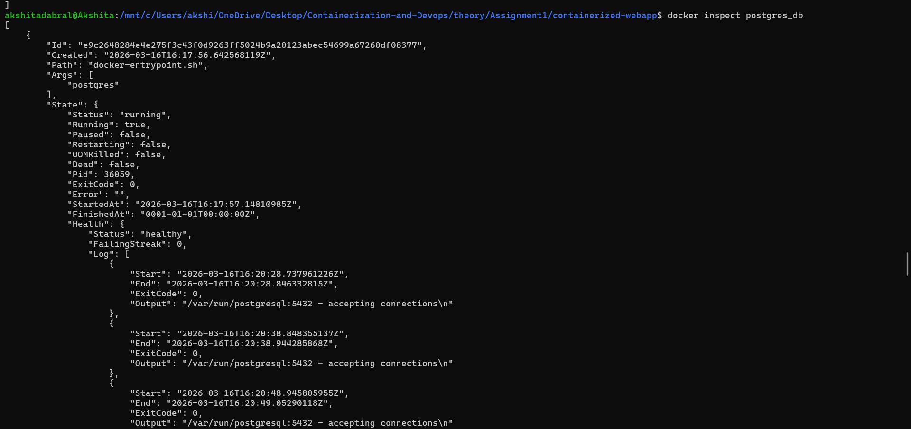


**Step-21:- Verify Data Persistence**
This step will verify that data stored in DB is permanently saved irrespective of the state of the container.
```bash
docker-compose down
docker-compose up -d
curl http://192.168.50.20:3000/users
```
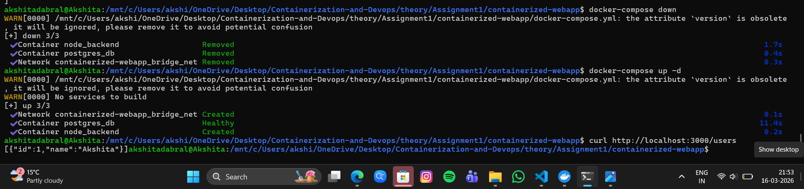


<hr>

<h4 align="center"> Report </h4>

<hr>


1. **Build Optimization Explanation**

Several techniques were applied during the Docker image build process to improve efficiency, security, and reduce the overall image size.
To begin with, the backend Dockerfile uses a multi-stage build strategy. In this method, dependencies are installed in an initial builder stage, and only the required application files are copied into the final runtime stage. This approach prevents unnecessary build tools, caches, and temporary files from being included in the final container image. As a result, the final Docker image becomes significantly smaller and more optimized for deployment.
Another optimization was the use of a lightweight base image. Instead of using the standard Node.js image, the project uses the node:20-alpine base image. Alpine Linux is specifically designed to be minimal and lightweight. Using this image helps reduce the overall container size and improves the container startup speed. Smaller images also reduce the time required to download images during deployment.
Additionally, a .dockerignore file was configured to prevent unnecessary files from being sent to the Docker build context. Files and directories such as:
- node_modules
- .git
- logs
- temporary files


were excluded. This reduces the amount of data transferred during the Docker build process, which speeds up the build and keeps the image clean.
Lastly, the container is configured to run under a non-root user account. Running containers as root can pose security risks if the application is compromised. By creating and using a non-root user inside the container, the application follows better security practices and reduces the potential impact of vulnerabilities.
These optimizations together result in a secure, lightweight, and production-ready container image.


<br>

2. **Network Design Diagram**

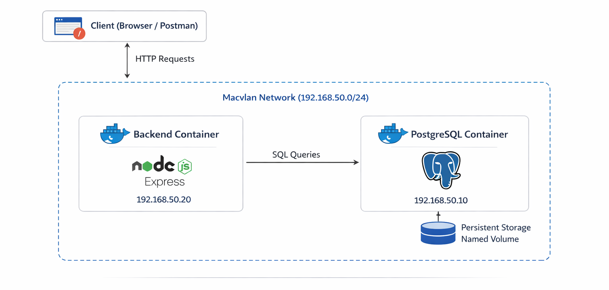

The project uses Macvlan networking to allow containers to appear as independent devices on the local area network (LAN). In this setup, each container is assigned a static IP address within the network subnet.
The architecture consists of three major components:
Client (Browser/Postman) – Sends HTTP requests to the backend API.


Backend Container (Node.js + Express) – Processes requests and communicates with the database.


PostgreSQL Container – Stores application data using a persistent volume.


Both containers are connected to an external Macvlan network, allowing them to communicate with each other using static IP addresses and also making them accessible from other devices on the LAN.

3.**Image Size Comparison**

The choice of base image has a major impact on the final Docker image size.

### Comparison Table

| Image | Approximate Size |
|------|------------------|
| node:20 | ~1.1 GB |
| node:20-alpine | ~180 MB |

The Alpine-based image is significantly smaller than the default Node.js image. Because of this, it requires less disk storage, downloads faster, and allows containers to start more quickly.

A smaller image size also improves deployment efficiency, especially in cloud environments where images may need to be pulled frequently.

For these reasons, the **node:20-alpine** image was selected for this project to keep the container lightweight and optimized.

---

4.**Macvlan vs IPvlan Comparison**

Both Macvlan and IPvlan are Docker network drivers that allow containers to communicate directly with the physical network. However, they differ in how they handle network interfaces and scalability.

| Feature | MACVLAN | IPVLAN |
|--------|--------|--------|
| MAC Addresses | One unique MAC address per container | All containers share the host MAC address |
| Network Switch Load | Higher because the switch learns many MAC addresses | Lower because only one MAC address is used |
| Scalability | Limited by the number of MAC addresses supported by the switch | Much higher scalability |
| Best Use Case | Small deployments or environments requiring unique MAC addresses | Large-scale container deployments |

Macvlan is useful when containers need to behave like **independent physical machines on the network**, while IPvlan is better suited for **large-scale deployments where network efficiency and scalability are important**.