# UNIT 1

## WSL
- Installing and Enabling WSL
``` bash
    wsl --install -d ubuntu 
```
- Installing Docker Engine on Ubuntu

``` bash
    sudo apt update
    sudo apt install docker.io
```
- Verifying
``` bash
    docker -v
    docker run hello-world
```
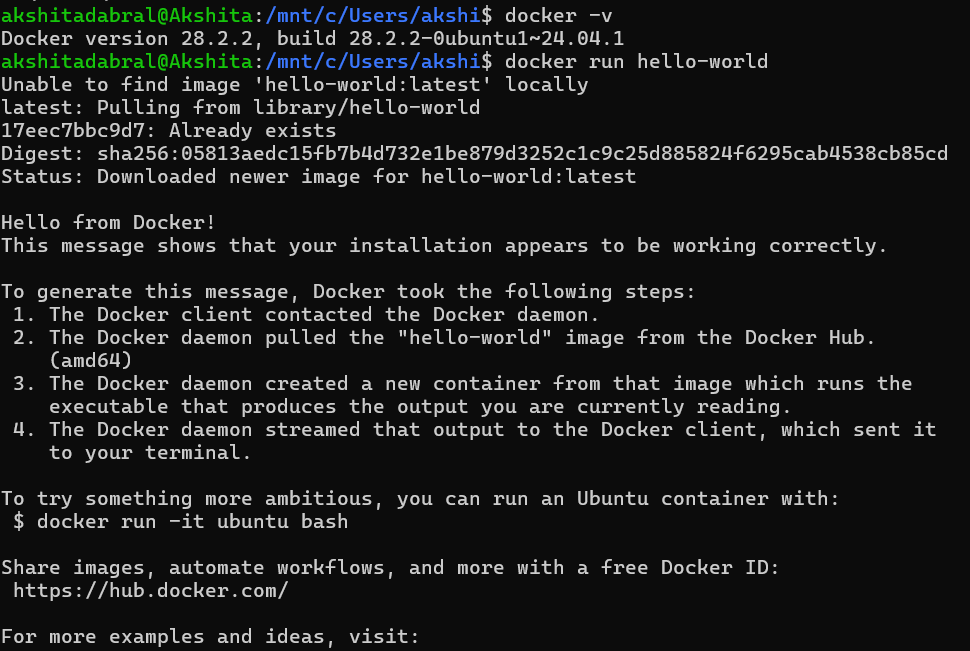

---

## DOCKER BASIC COMMANDS

- To check Docker Version
``` bash
    sudo docker version
```
- To List local images
``` bash
    docker images
```
- To pull image from registry
``` bash
docker pull ubuntu
```
- To remove image
``` bash
docker rmi ubuntu
``` 
- To run container
``` bash
docker run ubuntu
docker run -it --name test ubuntu bash
```
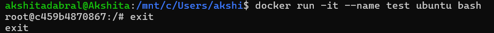

- List Containers
``` bash
docker ps
``` 
---

## TO PRESERVE CHANGES MADE INSIDE A CONTAINER

1. Run base Ubuntu container

``` bash
docker run -it --name java_lab ubuntu:22.04 
```
2. Install Java compiler inside the container
 ```bash
apt update
apt install -y openjdk-17-jdk
```
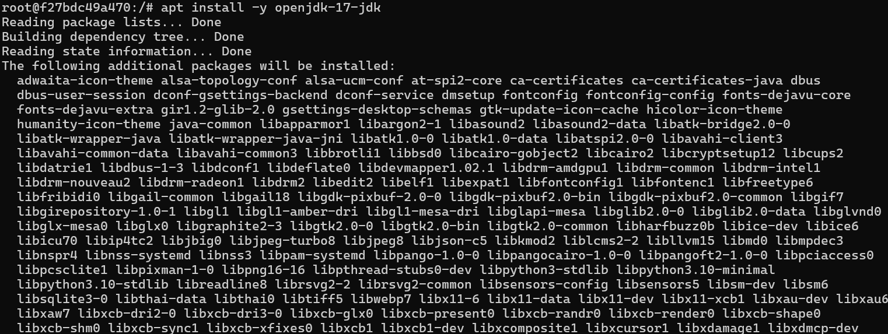
- Verify:
 ```bash
javac --version
```
3. Create Java App in /home/app
```bash
mkdir -p /home/app
cd /home/app
```
- Create Java File
``` bash
apt update
apt install -y nano
nano Hello.java
```
- Compile and Run
```bash
javac Hello.java
java Hello
```
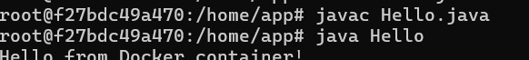

4. Exit container
``` bash
exit
```
5. Convert Container to Image
``` bash
docker commit java_lab myrepo/java-app:1.0
```
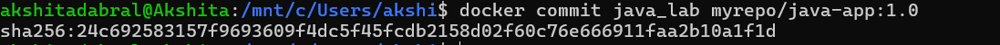

6. Reuse the exported image (locally)
```bash
docker run -it myrepo/java-app:1.0 bash
```
7. Save and Load Image(Offline Transfer)
```bash
docker save -o java-app.tar myrepo/java-app:1.0

docker load -i java-app.tar
```
---
## DOCKERFILE

1. Create [java docker](./java-docker/) with [Dockerfile](./java-docker/Dockerfile) and [Hello.java](./java-docker/Hello.java).

2.  Build Image from Docker file and verify
```bash
docker build -t java-app:1.0 .
docker images
```

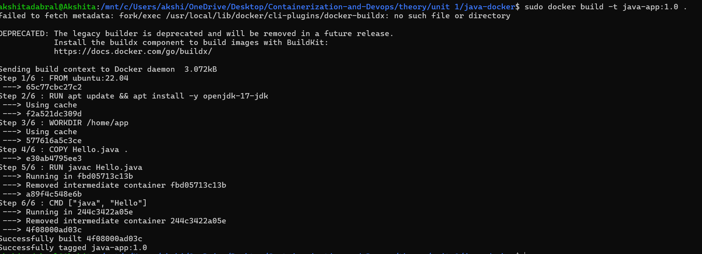

3. Run container from build images
``` bash
docker run java-app:1.0
```

4. Modifying CMD in [Second Dockerfile](./java-docker/Second%20Dockerfile)

- with : CMD ["echo", "Hello"]

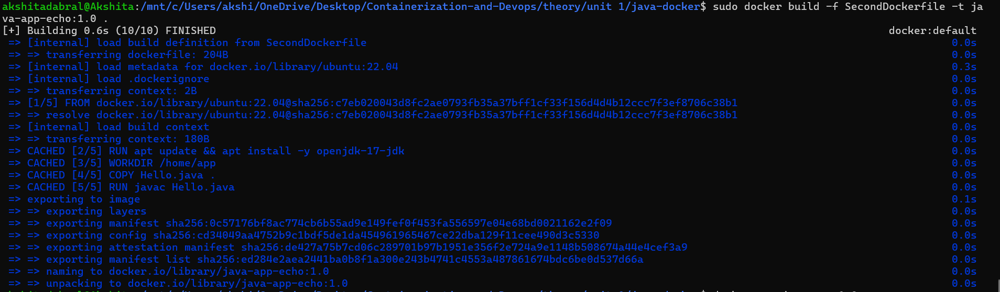

- which leads to different output,showcasing the Layered concept
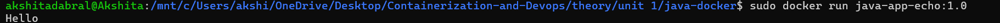

5. Push to Registry
```bash
sudo docker tag java-app:1.0 akshitadabral/java-app:1.0
sudo docker push akshitadabral/java-app:1.0
```
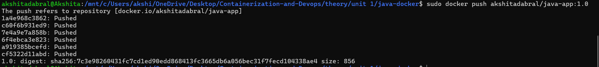

- Verifying
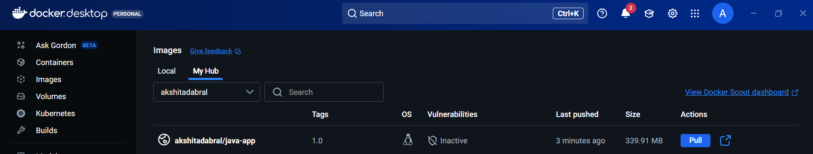

6. Pull anywhere
```bash
docker pull akshitadabral/java-app:1.0
docker run akshitadabral/java-app:1.0
```
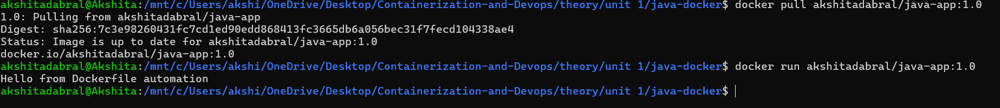

## DOCKER ENGINE API

1. Verify Docker API Socket in WSL
- Inside WSL

```bash
ls -l /var/run/docker.sock
```

2. API Versioning

```bash
curl --unix-socket /var/run/docker.sock http://localhost/version
```
3. List Containers

```bash
curl --unix-socket /var/run/docker.sock \
  http://localhost/v1.44/containers/json
  ```

4. Pull nginx
```bash
curl --unix-socket /var/run/docker.sock \
  -X POST \
  "http://localhost/v1.44/images/create?fromImage=nginx&tag=latest"
  ```
  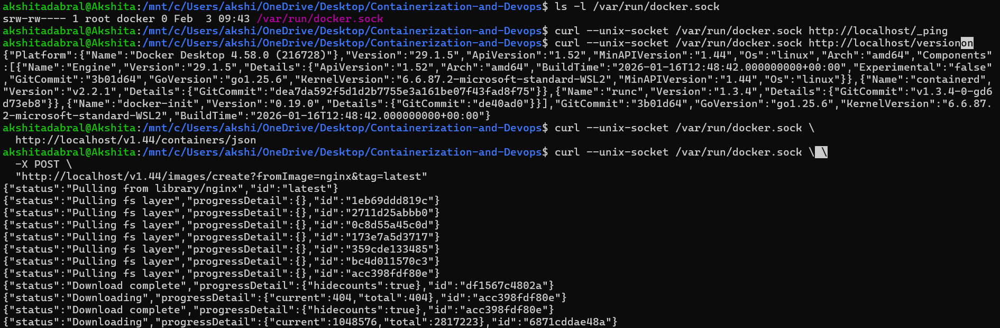

5. Start/Stop Container 
```bash
   curl --unix-socket /var/run/docker.sock \
  -X POST \
  http://localhost/v1.44/containers/mynginx/start
```
```bash
  curl --unix-socket /var/run/docker.sock \
  -X POST \
  http://localhost/v1.44/containers/mynginx/stop
```
---
## Expose Docker API in Linux/WSL(docker.io)

1. Open Docker Daemon Configuration File
```bash
sudo nano/etc/docker/daemon.json
```
Add:
```bash
{
  "hosts": [
    "tcp://0.0.0.0:2375",
    "unix:///var/run/docker.sock"
  ]
}
```
Save and Exit the File.

2. Stop the Docker Daemon
```bash
sudo pkill dockerd
```

3. Start Docker Daemon Manually
```bash
sudo dockerd &sudo dockerd &
```
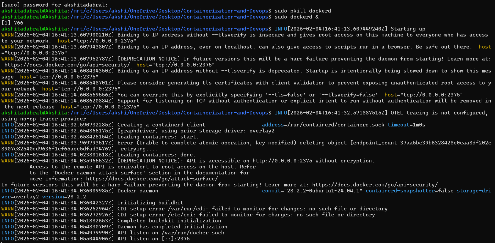

4. Verify Docker Is Listening on Port 2375
```bash
ss -lntp | grep 2375
```

5. Test Docker Remote API Using CURL
```bash
curl http://localhost:2375/containers/json
```
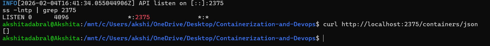
