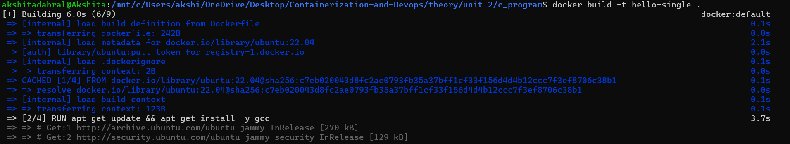
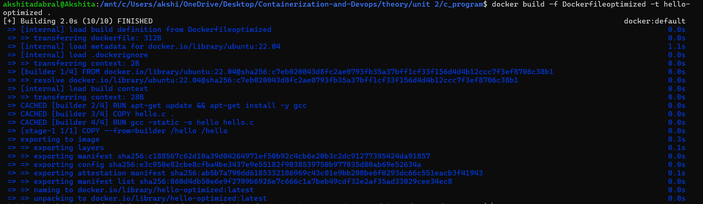
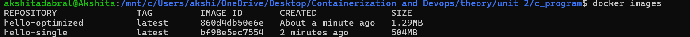

### Multistage Dockerfiles

1. Create a simple [C program](./hello.c).

---

2. Create the [Single Stage Docker file](./Dockerfile).

---

3. Create the [Multistaged Docker file](./Dockerfileoptimized).

---

4. Build the Single staged docker file.
```bash
docker build -t hello-single .
```


---

5. Build the Multi staged docker file.
```bash
docker build -f Dockerfileoptimized -t hello-optimized .
```


---

6. Docker image size reduced from 504 MB to 1.29 MB.
```bash
docker images
```
