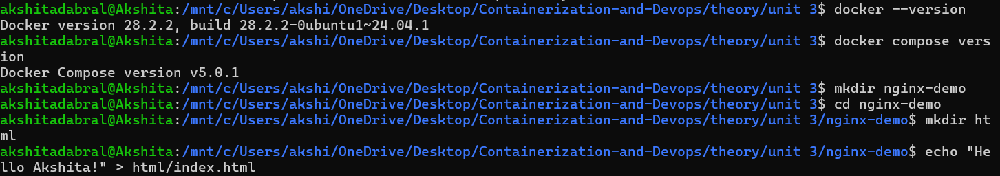
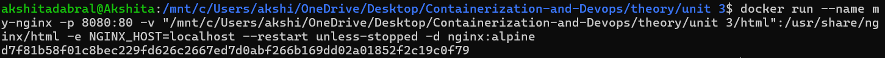
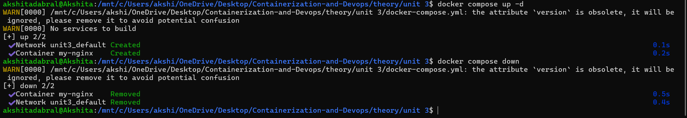
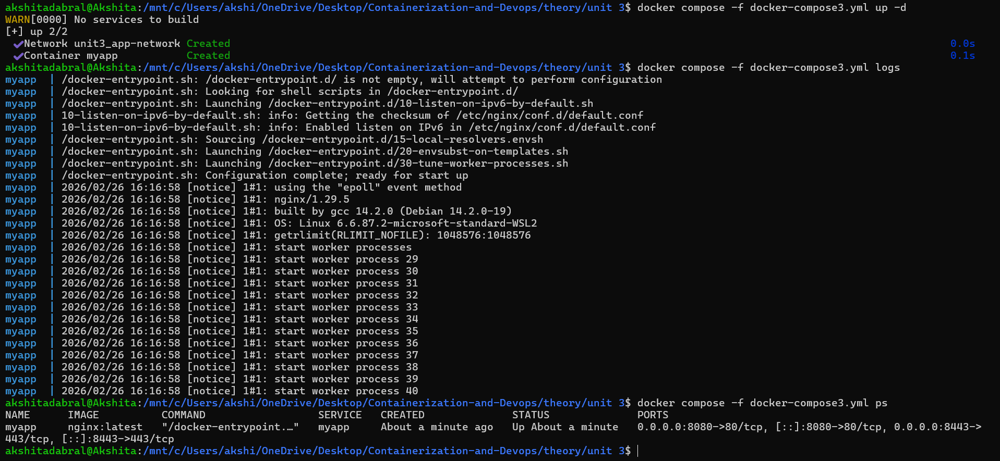
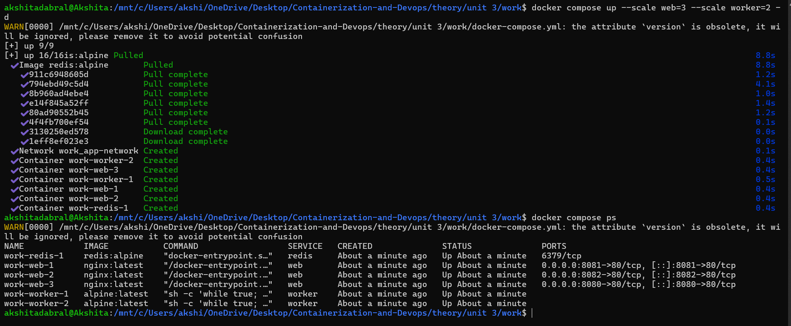
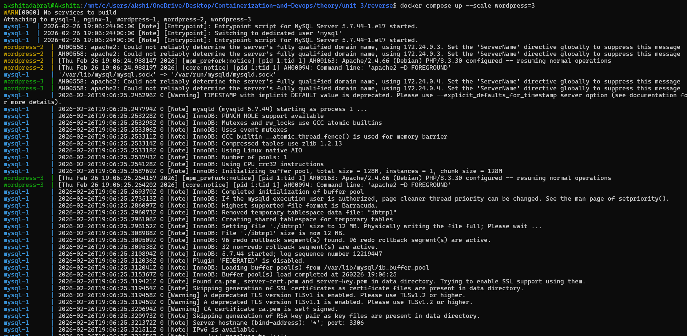
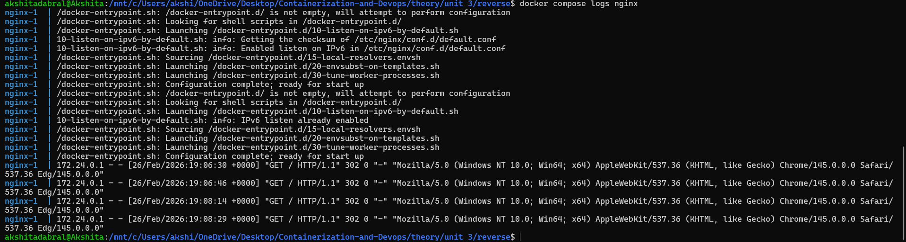

## Docker Compose vs Docker Run (Hands-On)

### Run Nginx using Docker Run
1. Create Project Folder
```bash
mkdir nginx-demo
cd nginx-demo
```
2. Create HTML Folder
```bash
mkdir html
echo "Hello Akshita!" > html/index.html
```


3. Run Nginx (Docker Run)
```bash
docker run \
 --name my-nginx \
 -p 8080:80 \
 -v $(pwd)/html:/usr/share/nginx/html \
 -e NGINX_HOST=localhost \
 --restart unless-stopped \
 -d \
 nginx:alpine
 ```

 

Open browser: http://localhost:8080


Now stop and remove:
```bash
docker stop my-nginx
docker rm my-nginx
```
### Same Setup using Docker Compose

1. Create [docker-compose.yml](./docker-compose.yml)
```bash
version: '3.8'

services:
  nginx:
    image: nginx:alpine
    container_name: my-nginx
    ports:
      - "8080:80"
    volumes:
      - ./html:/usr/share/nginx/html
    environment:
      - NGINX_HOST=localhost
    restart: unless-stopped
```
Run:
```bash
docker compose up -d
```
Stop:
```bash
docker compose down
```

---


### Multi-Container Example
#### Scenario: WordPress with MySQL


1. Using Docker Run (Tedious Way)
```bash
Step 1: Create Volumes
docker volume create wp_content
docker volume create mysql_data
Step 2: Create Network
docker network create wordpress-network
Step 3: Run MySQL
docker run \
 --name mysql \
 --network wordpress-network \
 -e MYSQL_ROOT_PASSWORD=secret \
 -e MYSQL_DATABASE=wordpress \
 -e MYSQL_USER=wpuser \
 -e MYSQL_PASSWORD=wppass \
 -v mysql_data:/var/lib/mysql \
 -d \
 mysql:5.7
Step 4: Run WordPress
docker run \
 --name wordpress \
 --network wordpress-network \
 -p 8080:80 \
 -e WORDPRESS_DB_HOST=mysql \
 -e WORDPRESS_DB_USER=wpuser \
 -e WORDPRESS_DB_PASSWORD=wppass \
 -e WORDPRESS_DB_NAME=wordpress \
 -v wp_content:/var/www/html/wp-content \
 -d \
 wordpress:latest
 ```
2. Using Docker Compose (Simple Way)

Create [docker-compose2.yml](./docker-compose2.yml)
```bash
version: '3.8'

services:
  mysql:
    image: mysql:5.7
    container_name: mysql
    environment:
      MYSQL_ROOT_PASSWORD: secret
      MYSQL_DATABASE: wordpress
      MYSQL_USER: wpuser
      MYSQL_PASSWORD: wppass
    volumes:
      - mysql_data:/var/lib/mysql
    networks:
      - wordpress-network

  wordpress:
    image: wordpress:latest
    container_name: wordpress
    ports:
      - "8080:80"
    environment:
      WORDPRESS_DB_HOST: mysql
      WORDPRESS_DB_USER: wpuser
      WORDPRESS_DB_PASSWORD: wppass
      WORDPRESS_DB_NAME: wordpress
    volumes:
      - wp_content:/var/www/html/wp-content
    depends_on:
      - mysql
    networks:
      - wordpress-network

volumes:
  mysql_data:
  wp_content:

networks:
  wordpress-network:
```
- Run with ONE command:
```bash
docker compose -f docker-compose2.yml up -d
```
- Stop:
```bash
docker compose -f docker-compose2.yml down
```

## Real Conversion Example

Let's convert a complex Docker run command to Docker Compose:

- Original Docker Run Command:
```bash
docker run -d \
 --name myapp \
 --hostname app-server \
 -p 8080:80 \
 -p 8443:443 \
 -v /opt/app/config:/etc/app \
 -v app-data:/var/lib/app \
 -e APP_ENV=production \
 -e DB_URL=postgres://user:pass@db:5432/app \
 --network app-network \
 --restart always \
 --memory="512m" \
 --cpus="1.0" \
 myimage:latest \
 --log-level debug
 ```
- Equivalent [Docker Compose](./docker-compose3.yml)
```bash
services:
  myapp:
    image: nginx:latest
    container_name: myapp
    hostname: app-server

    ports:
      - "8080:80"
      - "8443:443"

    volumes:
      - ./config:/etc/app
      - app-data:/var/lib/app

    environment:
      APP_ENV: production
      DB_URL: postgres://user:pass@db:5432/app

    networks:
      - app-network

    restart: always

volumes:
  app-data:

networks:
  app-network:
  ```
- Run:
```bash
docker compose -f docker-compose3.yml up -d
```
### Lifecycle Management
```bash
docker compose up
docker compose down
docker compose logs
docker compose ps
```


---
## Scaling WordPress with [Docker Compose](./reverse)
### Docker Compose Scaling
1. Scale Command
```bash
docker compose up --scale web=3 --scale worker=2
up
```
2. Create [docker-compose.yml](./work/docker-compose.yml)
- Running the Scale Command and checking running containers
```bash
docker compose up --scale web=3 --scale worker=2 -d
docker compose ps
```


## Scaling WordPress + MySQL with Reverse Proxy (Docker Compose)
1. [Docker Compose](./reverse/docker-compose.yml)
2. [Create Nginx Configuration](./reverse/nginx.conf)

3. Start Containers
```bash 
docker compose up -d
```
4. Scale WordPress
```bash
docker compose up --scale wordpress=3 -d
```

5. Test Load Balancing

Refresh your WordPress site multiple times.

Nginx distributes traffic across containers.

6. Check Logs 
```bash
docker compose logs nginx
```
