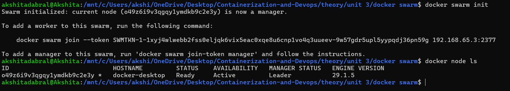
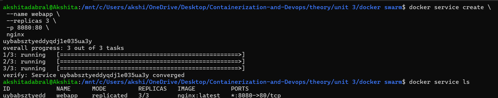
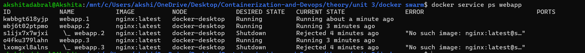
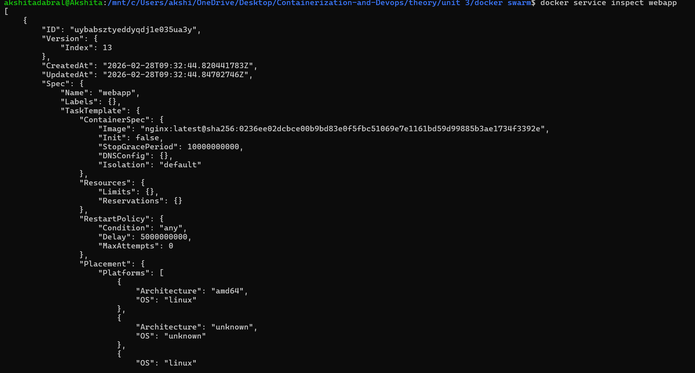
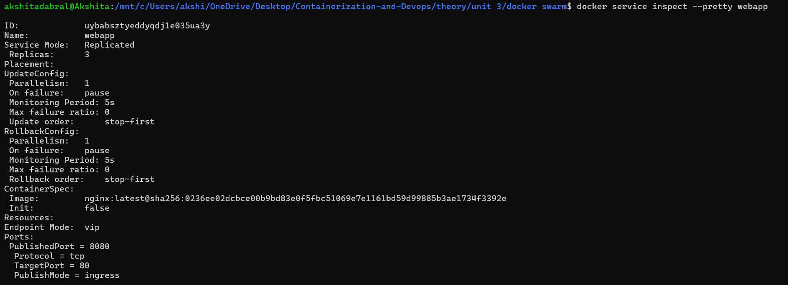
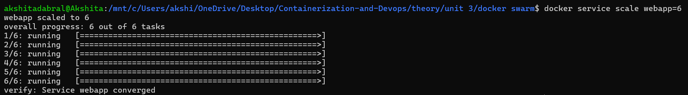
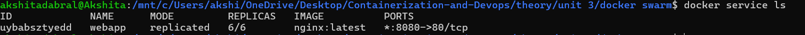

## Swarm
---
### HANDS-ON LAB

### PART A — Create a Swarm
- **Objective**: Initialize cluster manager.

1. Initialize Swarm
```bash
docker swarm init
```
---
2. Verify Node 
```bash
docker node ls 
```


---
### PART B — Add Nodes to Swarm 
- Use Case Production setup: 
1. Manager 
2. Worker nodes 
- On Worker Machine Run join command (copied from manager)
```bash
docker swarm join --token <TOKEN> <MANAGER-IP>:2377
```
- Verify on Manager: 
```bash
docker node ls
```
---
### PART C — Deploy a Service
- **Use Case**
Deploy web server with 3 replicas.
1. Create Service
```bash
docker service create \
 --name webapp \
 --replicas 3 \
 -p 8080:80 \
 nginx
 ```
2. Check Services
```bash
docker service ls
```

3. Inspect Tasks
```bash
docker service ps webapp
```


---

### PART D — Inspect the Service
- **Use Case**
1.Check configuration & runtime details.
```bash
docker service inspect webapp
```

2. For formatted output:(Human-readable format)
```bash
docker service inspect --pretty webapp
```

---
## PART E — Scale the Service
- **Use Case**
1. Traffic increased during sale → need 6 replicas.
```bash
docker service scale webapp=6
```

2. Verify:
```bash
docker service ls
```

